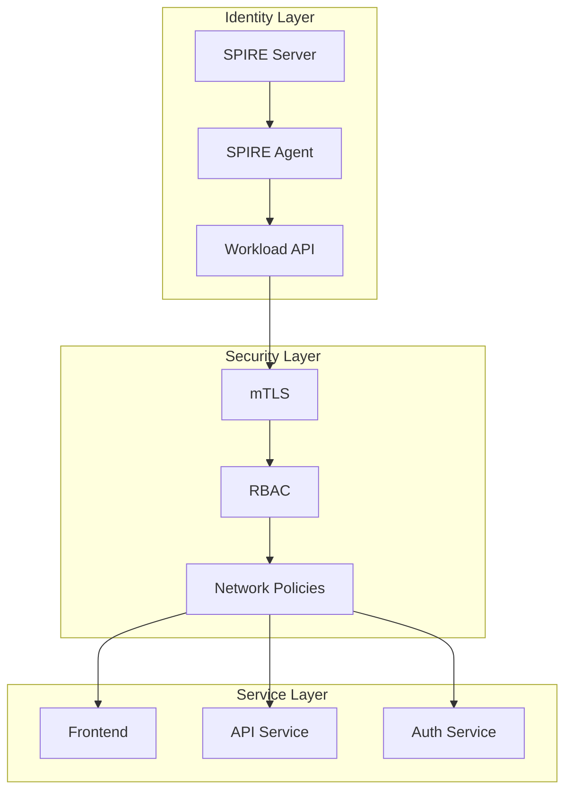
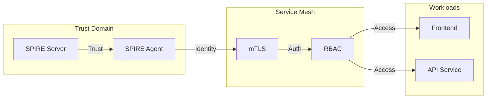

# SPIFFE/SPIRE Architecture Demo

This repository demonstrates a production-ready implementation of the SPIFFE/SPIRE architecture for secure service-to-service communication and workload identity. The implementation follows SPIFFE standards and best practices for workload identity and PKI management.

## Architecture Deep Dive

### System Overview

The architecture implements a zero-trust security model using SPIFFE/SPIRE for workload identity and mTLS for secure communication. The system consists of several key components working together:

1. **Identity Management Layer**
   - SPIRE Server: Central authority for identity issuance
   - SPIRE Agent: Node-level identity attestation
   - Workload API: Identity distribution mechanism

2. **Security Layer**
   - mTLS: Service-to-service encryption
   - RBAC: Role-based access control
   - Network Policies: Traffic isolation

3. **Service Layer**
   - Frontend Service: User interface
   - API Service: Business logic
   - Authentication Service: Identity verification

### Component Interactions

#### Identity Flow
1. **Workload Registration**
   ```mermaid
   graph LR
   A[Workload] --> B[SPIRE Agent]
   B --> C[SPIRE Server]
   C --> D[Trust Domain]
   D --> E[SVID Issuance]
   E --> F[Workload API]
   F --> A
   ```

2. **Service Communication**
   ```mermaid
   graph LR
   A[Frontend] --> B[mTLS Handshake]
   B --> C[Identity Verification]
   C --> D[API Service]
   D --> E[Auth Service]
   E --> F[RBAC Check]
   ```

### Security Architecture

#### Trust Model
1. **Trust Domain**
   - Hierarchical trust structure
   - Cross-domain trust relationships
   - Trust bundle management

2. **Identity Verification**
   - SVID validation
   - Trust chain verification
   - Certificate validation

3. **Access Control**
   - Role-based permissions
   - Service-to-service policies
   - Network isolation

## Implementation Details

### SPIRE Server Configuration

#### Trust Domain Setup
```yaml
trust_domain = "example.org"
ca_key_type = "rsa-2048"
ca_ttl = "168h"  # 7 days
```

#### Node Attestation
```yaml
plugins {
    NodeAttestor "k8s_psat" {
        plugin_data {
            clusters = {
                "demo" = {
                    service_account_allow_list = ["spire:spire-agent"]
                    audience = ["spire-server"]
                }
            }
        }
    }
}
```

#### Workload Registration
```yaml
entries = [
    {
        spiffe_id = "spiffe://example.org/frontend"
        parent_id = "spiffe://example.org/spire/agent/k8s_psat/demo/spire-agent"
        selectors = [
            "k8s:ns:demo",
            "k8s:pod-label:app:frontend"
        ]
    }
]
```

### SPIRE Agent Configuration

#### Agent Setup
```yaml
agent {
    data_dir = "/run/spire/data"
    log_level = "INFO"
    workload_api {
        socket_path = "/run/spire/sockets/workload_api.sock"
        trust_domain = "example.org"
    }
}
```

#### Workload Attestation
```yaml
plugins {
    WorkloadAttestor "k8s" {
        plugin_data {
            node_name = "$(NODE_NAME)"
            trust_domain = "example.org"
        }
    }
}
```

### Service Mesh Integration

#### Istio Configuration
```yaml
apiVersion: install.istio.io/v1alpha1
kind: IstioOperator
spec:
  meshConfig:
    enableSds: true
    sdsUdsPath: "unix:/run/spire/sockets/workload_api.sock"
    trustDomain: "example.org"
```

#### mTLS Policy
```yaml
apiVersion: security.istio.io/v1beta1
kind: PeerAuthentication
metadata:
  name: default
  namespace: demo
spec:
  mtls:
    mode: STRICT
```

## Best Practices

### Security Best Practices

1. **Trust Domain Management**
   - Use unique trust domains per environment
   - Implement proper trust domain isolation
   - Regular trust bundle rotation
   - Secure trust domain configuration

2. **Certificate Management**
   - Regular SVID rotation (4-hour intervals)
   - CA certificate rotation (7-day intervals)
   - Secure certificate storage
   - Proper certificate validation

3. **Workload Identity**
   - Strict workload attestation
   - Proper identity verification
   - Regular identity rotation
   - Secure identity storage

4. **Network Security**
   - Strict mTLS enforcement
   - Network policy implementation
   - Service isolation
   - Egress control

### Operational Best Practices

1. **Monitoring**
   - SVID issuance metrics
   - Certificate rotation tracking
   - Trust bundle updates
   - Workload attestation monitoring

2. **Logging**
   - Security event logging
   - Certificate operation logging
   - Workload attestation logging
   - Access control logging

3. **Maintenance**
   - Regular component updates
   - Security policy reviews
   - Certificate rotation
   - Trust bundle updates

4. **Recovery**
   - Backup procedures
   - Restore procedures
   - Emergency rotation
   - Disaster recovery

### Development Best Practices

1. **Code Security**
   - Secure coding practices
   - Regular security audits
   - Dependency management
   - Vulnerability scanning

2. **Testing**
   - Unit testing
   - Integration testing
   - Security testing
   - Performance testing

3. **Documentation**
   - Architecture documentation
   - Security documentation
   - Operational documentation
   - Troubleshooting guides

## Deployment Considerations

### Infrastructure Requirements

1. **Kubernetes**
   - Version 1.20+
   - RBAC enabled
   - Network policies supported
   - Service mesh capability

2. **SPIRE**
   - Version 1.5.0+
   - Proper resource allocation
   - High availability setup
   - Backup configuration

3. **Istio**
   - Version 1.15+
   - mTLS support
   - SDS configuration
   - Proper resource allocation

### Performance Considerations

1. **Resource Allocation**
   - CPU requirements
   - Memory requirements
   - Storage requirements
   - Network bandwidth

2. **Scalability**
   - Horizontal scaling
   - Vertical scaling
   - Load balancing
   - Resource limits

3. **High Availability**
   - Multi-node setup
   - Failover configuration
   - Backup procedures
   - Recovery procedures

## Troubleshooting Guide

### Common Issues

1. **SVID Issues**
   - Issuance failures
   - Rotation problems
   - Validation errors
   - Trust chain issues

2. **Workload Issues**
   - Attestation failures
   - Identity problems
   - API access issues
   - Communication errors

3. **Service Mesh Issues**
   - mTLS configuration
   - SDS problems
   - Traffic management
   - Policy enforcement

### Debugging Procedures

1. **SPIRE Server**
   ```bash
   # Check server status
   kubectl exec -n spire deploy/spire-server -- spire-server healthcheck
   
   # View server logs
   kubectl logs -n spire -l app=spire-server
   
   # Check entries
   kubectl exec -n spire deploy/spire-server -- spire-server entry show
   ```

2. **SPIRE Agent**
   ```bash
   # Check agent status
   kubectl exec -n spire -l app=spire-agent -- spire-agent healthcheck
   
   # View agent logs
   kubectl logs -n spire -l app=spire-agent
   
   # Check workload API
   kubectl exec -n demo -l app=frontend -- spiffe-helper status
   ```

3. **Service Mesh**
   ```bash
   # Check Istio status
   istioctl proxy-status
   
   # Verify mTLS
   istioctl authn tls-check
   
   # Analyze configuration
   istioctl analyze
   ```

## Maintenance Procedures

### Regular Maintenance

1. **Certificate Rotation**
   - SVID rotation
   - CA rotation
   - Trust bundle updates
   - Key rotation

2. **Component Updates**
   - SPIRE updates
   - Istio updates
   - Kubernetes updates
   - Security patches

3. **Security Reviews**
   - Policy reviews
   - Access control reviews
   - Certificate management
   - Trust domain management

### Emergency Procedures

1. **Certificate Recovery**
   - SVID recovery
   - CA recovery
   - Trust bundle recovery
   - Key recovery

2. **Component Recovery**
   - Server recovery
   - Agent recovery
   - Service recovery
   - Data recovery

3. **Security Incidents**
   - Incident response
   - Forensic analysis
   - Remediation
   - Prevention

## Monitoring and Alerting

### Key Metrics

1. **SPIRE Metrics**
   - SVID issuance rate
   - Certificate rotation
   - Trust bundle updates
   - Workload attestation

2. **Service Metrics**
   - API performance
   - Error rates
   - Latency
   - Throughput

3. **Security Metrics**
   - Authentication success/failure
   - Authorization success/failure
   - Certificate validation
   - Policy enforcement

### Alerting Configuration

1. **Critical Alerts**
   - SVID issuance failures
   - Certificate rotation failures
   - Trust bundle update failures
   - Workload attestation failures

2. **Warning Alerts**
   - High error rates
   - Performance degradation
   - Resource constraints
   - Security policy violations

3. **Info Alerts**
   - Component updates
   - Configuration changes
   - Policy updates
   - Maintenance events

## Future Considerations

### Planned Improvements

1. **Security Enhancements**
   - Additional authentication methods
   - Enhanced authorization
   - Improved monitoring
   - Advanced threat detection

2. **Performance Optimizations**
   - Resource optimization
   - Caching improvements
   - Load balancing
   - Scaling enhancements

3. **Feature Additions**
   - New authentication methods
   - Additional service mesh features
   - Enhanced monitoring
   - Improved tooling

### Roadmap

1. **Short-term Goals**
   - Performance optimization
   - Security enhancements
   - Monitoring improvements
   - Documentation updates

2. **Medium-term Goals**
   - Feature additions
   - Architecture improvements
   - Tooling enhancements
   - Community engagement

3. **Long-term Goals**
   - Platform evolution
   - Ecosystem growth
   - Standard adoption
   - Industry leadership

## Repository Structure

```
.
├── infrastructure/
│   ├── kubernetes/
│   │   ├── monitoring/          # Prometheus, Grafana, and logging setup
│   │   ├── security/           # Security policies and configurations
│   │   │   ├── pss/           # Pod Security Standards
│   │   │   ├── network-policies/ # Network isolation rules
│   │   │   └── scc/           # Security Context Constraints
│   │   └── spire/             # SPIRE server and agent configurations
│   │       ├── agent/         # SPIRE agent deployment
│   │       ├── server/        # SPIRE server deployment
│   │       ├── config/        # SPIRE configuration files
│   │       └── scripts/       # Deployment and management scripts
│   └── terraform/             # Infrastructure as Code
├── mTLS_demo/                 # Example implementation
│   ├── examples/              # Code examples
│   │   └── middleware_usage/  # Authentication middleware examples
│   ├── auth/                  # Authentication service
│   ├── transport/            # Transport layer security
│   ├── workloads/            # Example workloads
│   └── core/                 # Core functionality
└── docs/                     # Additional documentation
```

## Architecture Overview

### Core Components

#### SPIRE Server (`infrastructure/kubernetes/spire/server/`)
- **Role**: Central authority for workload identity
- **Key Features**:
  - SVID issuance and validation
  - Registration entry management
  - Node attestation
  - Trust domain management
- **SPIFFE-specific**:
  - Implements SPIFFE Workload API
  - Manages SPIFFE ID lifecycle
  - Enforces trust domain policies
- **PKI Management**:
  - CA certificate management
  - SVID signing
  - Certificate rotation
  - Trust bundle distribution

#### SPIRE Agent (`infrastructure/kubernetes/spire/agent/`)
- **Role**: Node-level workload attestation
- **Key Features**:
  - Node identity attestation
  - Workload API endpoint
  - SVID caching
  - Workload attestation
- **SPIFFE-specific**:
  - Implements SPIFFE Workload API
  - Manages workload identity
  - Handles SVID rotation
- **PKI Operations**:
  - SVID caching
  - Certificate rotation
  - Trust bundle management

#### Service Mesh Integration (`infrastructure/kubernetes/spire/config/`)
- **Role**: mTLS and traffic management
- **Key Features**:
  - Automatic mTLS
  - Traffic management
  - Load balancing
  - Circuit breaking
- **SPIFFE Integration**:
  - SPIFFE ID-based routing
  - Trust domain validation
  - SVID validation
- **PKI Integration**:
  - Certificate injection
  - Trust bundle distribution
  - mTLS enforcement

### Security Components

#### Pod Security Standards (`infrastructure/kubernetes/security/pss/`)
- **Role**: Container security enforcement
- **Key Features**:
  - Privilege restrictions
  - Security context enforcement
  - Resource limits
- **SPIFFE Considerations**:
  - Workload API access
  - SVID storage
  - Trust bundle access

#### Network Policies (`infrastructure/kubernetes/security/network-policies/`)
- **Role**: Network isolation
- **Key Features**:
  - Pod-to-pod communication
  - Service isolation
  - Egress control
- **SPIFFE Integration**:
  - Workload API access
  - Trust domain communication
  - SVID distribution

#### Security Context Constraints (`infrastructure/kubernetes/security/scc/`)
- **Role**: Cluster-level security
- **Key Features**:
  - Privilege management
  - Security context
  - Resource control
- **SPIFFE Requirements**:
  - Workload API access
  - Certificate storage
  - Trust bundle access

### Monitoring and Observability

#### Prometheus Configuration (`infrastructure/kubernetes/monitoring/prometheus/`)
- **Role**: Metrics collection
- **Key Metrics**:
  - SVID issuance
  - Certificate rotation
  - Trust bundle updates
  - Workload attestation
- **SPIFFE-specific Metrics**:
  - Workload API calls
  - SVID lifecycle
  - Trust domain operations

#### Logging Configuration (`infrastructure/kubernetes/monitoring/logging/`)
- **Role**: Log management
- **Key Logs**:
  - Security events
  - Certificate operations
  - Workload attestation
- **SPIFFE-specific Logs**:
  - SVID issuance
  - Trust domain operations
  - Workload API access

## SPIFFE/SPIRE Specifics

### Trust Domain Configuration
- **Location**: `infrastructure/kubernetes/spire/config/`
- **Key Components**:
  - Trust domain definition
  - CA configuration
  - SVID settings
  - Workload API configuration

### Workload Identity
- **SPIFFE ID Format**: `spiffe://<trust-domain>/<workload-path>`
- **Implementation**: `mTLS_demo/core/identity/`
- **Key Features**:
  - Automatic identity assignment
  - Identity verification
  - Secure rotation
  - Trust domain validation

### PKI Management
- **Certificate Types**:
  - SVIDs (SPIFFE Verifiable Identity Documents)
  - CA certificates
  - Trust bundles
- **Operations**:
  - Certificate issuance
  - Rotation
  - Validation
  - Revocation
- **Storage**:
  - Memory-backed
  - Secure access
  - Automatic cleanup

## PKI Management Details

### Certificate Types and Lifecycle

#### SVIDs (SPIFFE Verifiable Identity Documents)
- **Format**: X.509 certificates with SPIFFE ID in SAN
- **Location**: `/run/spiffe/certs/svid.pem`
- **Rotation**: Every 4 hours (configurable)
- **Validation**:
  ```yaml
  validation:
    max_lifetime: "4h"
    min_lifetime: "1h"
    rotation_threshold: "80%"
  ```

#### CA Certificates
- **Format**: X.509 CA certificates
- **Location**: `/run/spire/data/server/ca.crt`
- **Rotation**: Every 7 days (configurable)
- **Configuration**:
  ```yaml
  ca:
    key_type: "rsa-2048"
    ttl: "168h"  # 7 days
    rotation_threshold: "80%"
  ```

#### Trust Bundles
- **Format**: PEM-encoded certificates
- **Location**: `/run/spiffe/certs/root-ca.crt`
- **Refresh**: Every 1 hour (configurable)
- **Distribution**:
  ```yaml
  trust_bundle:
    refresh_interval: "1h"
    max_lifetime: "24h"
    distribution:
      - "workload_api"
      - "registration_api"
  ```

### Certificate Operations

#### Issuance
```yaml
issuance:
  # SVID Issuance
  svid:
    ttl: "4h"
    key_type: "rsa-2048"
    dns_names: ["localhost"]
    ip_addresses: ["127.0.0.1"]
    
  # CA Issuance
  ca:
    ttl: "168h"
    key_type: "rsa-2048"
    organization: "SPIRE"
    country: "US"
```

#### Rotation
```yaml
rotation:
  # SVID Rotation
  svid:
    threshold: "80%"
    min_interval: "1h"
    max_interval: "4h"
    
  # CA Rotation
  ca:
    threshold: "80%"
    min_interval: "24h"
    max_interval: "168h"
```

#### Validation
```yaml
validation:
  # SVID Validation
  svid:
    require_spiffe_id: true
    require_trust_domain: "example.org"
    require_dns_names: true
    
  # CA Validation
  ca:
    require_organization: true
    require_country: true
    require_key_usage: true
```

### Storage and Security

#### Certificate Storage
```yaml
storage:
  # Memory-backed Storage
  memory:
    enabled: true
    cleanup_interval: "1h"
    
  # Persistent Storage (Optional)
  persistent:
    enabled: false
    path: "/run/spire/data"
    encryption:
      enabled: true
      algorithm: "aes-256-gcm"
```

#### Key Management
```yaml
key_management:
  # Key Generation
  generation:
    algorithm: "rsa"
    size: 2048
    curve: "P-256"
    
  # Key Storage
  storage:
    type: "memory"
    encryption: true
    access_control: true
```

### Monitoring and Auditing

#### Certificate Metrics
```yaml
metrics:
  # SVID Metrics
  svid:
    - issuance_count
    - rotation_count
    - expiration_time
    - validation_count
    
  # CA Metrics
  ca:
    - issuance_count
    - rotation_count
    - expiration_time
    - validation_count
```

#### Audit Logging
```yaml
audit:
  # Certificate Operations
  certificates:
    - issuance
    - rotation
    - validation
    - revocation
    
  # Access Logging
  access:
    - read
    - write
    - delete
```

### Integration with Service Mesh

#### Istio Integration
```yaml
istio:
  # SDS Configuration
  sds:
    enabled: true
    uds_path: "/run/spire/sockets/workload_api.sock"
    
  # Certificate Injection
  cert_injection:
    enabled: true
    mount_path: "/run/spire/certs"
```

#### mTLS Configuration
```yaml
mtls:
  # Peer Authentication
  peer_auth:
    mode: "STRICT"
    mtls:
      mode: "STRICT"
      
  # Certificate Validation
  validation:
    require_spiffe_id: true
    require_trust_domain: "example.org"
```

### Recovery Procedures

#### Certificate Recovery
```yaml
recovery:
  # SVID Recovery
  svid:
    - restart_workload
    - reissue_certificate
    - verify_identity
    
  # CA Recovery
  ca:
    - backup_restore
    - reissue_certificate
    - update_trust_bundle
```

#### Key Recovery
```yaml
key_recovery:
  # Key Backup
  backup:
    enabled: true
    interval: "24h"
    location: "/run/spire/backup"
    
  # Key Restore
  restore:
    enabled: true
    verification: true
    rotation: true
```

## Detailed Deployment Guide

### Prerequisites Verification

1. **Kubernetes Cluster**
   ```bash
   # Verify cluster version
   kubectl version --short
   
   # Check cluster features
   kubectl api-resources | grep -E 'networkpolicies|podsecuritypolicies'
   
   # Verify RBAC
   kubectl auth can-i create deployments --all-namespaces
   ```

2. **SPIRE Requirements**
   ```bash
   # Check SPIRE version
   spire-server version
   spire-agent version
   
   # Verify SPIRE installation
   which spire-server
   which spire-agent
   ```

3. **Istio Requirements**
   ```bash
   # Check Istio version
   istioctl version
   
   # Verify Istio installation
   istioctl verify-install
   ```

### Infrastructure Setup

1. **Terraform Initialization**
   ```bash
   # Initialize Terraform
   cd infrastructure/terraform
   terraform init
   
   # Verify providers
   terraform providers
   
   # Plan deployment
   terraform plan -out=tfplan
   ```

2. **Infrastructure Deployment**
   ```bash
   # Apply infrastructure
   terraform apply tfplan
   
   # Verify resources
   terraform state list
   ```

### SPIRE Deployment

1. **Namespace Setup**
   ```bash
   # Create SPIRE namespace
   kubectl create namespace spire
   
   # Create demo namespace
   kubectl create namespace demo
   ```

2. **Secret Generation**
   ```bash
   # Generate SPIRE secrets
   ./infrastructure/kubernetes/spire/scripts/generate-secrets.sh
   
   # Verify secrets
   kubectl get secrets -n spire
   ```

3. **SPIRE Server Deployment**
   ```bash
   # Deploy SPIRE server
   kubectl apply -f infrastructure/kubernetes/spire/server/
   
   # Verify deployment
   kubectl get pods -n spire -l app=spire-server
   kubectl logs -n spire -l app=spire-server
   ```

4. **SPIRE Agent Deployment**
   ```bash
   # Deploy SPIRE agent
   kubectl apply -f infrastructure/kubernetes/spire/agent/
   
   # Verify deployment
   kubectl get pods -n spire -l app=spire-agent
   kubectl logs -n spire -l app=spire-agent
   ```

### Security Policy Deployment

1. **Pod Security Standards**
   ```bash
   # Apply PSS
   kubectl apply -f infrastructure/kubernetes/security/pss/
   
   # Verify policies
   kubectl get psp
   ```

2. **Network Policies**
   ```bash
   # Apply network policies
   kubectl apply -f infrastructure/kubernetes/security/network-policies/
   
   # Verify policies
   kubectl get networkpolicies --all-namespaces
   ```

3. **Security Context Constraints**
   ```bash
   # Apply SCCs
   kubectl apply -f infrastructure/kubernetes/security/scc/
   
   # Verify constraints
   kubectl get scc
   ```

### Service Mesh Deployment

1. **Istio Installation**
   ```bash
   # Install Istio
   istioctl install -f infrastructure/kubernetes/spire/config/istio-config.yaml
   
   # Verify installation
   istioctl verify-install
   ```

2. **mTLS Configuration**
   ```bash
   # Apply mTLS policies
   kubectl apply -f infrastructure/kubernetes/spire/config/mtls-config.yaml
   
   # Verify policies
   kubectl get peerauthentication --all-namespaces
   ```

### Workload Deployment

1. **Authentication Service**
   ```bash
   # Deploy auth service
   kubectl apply -f mTLS_demo/auth/
   
   # Verify deployment
   kubectl get pods -n demo -l app=auth
   kubectl logs -n demo -l app=auth
   ```

2. **API Service**
   ```bash
   # Deploy API service
   kubectl apply -f mTLS_demo/api/
   
   # Verify deployment
   kubectl get pods -n demo -l app=api
   kubectl logs -n demo -l app=api
   ```

3. **Frontend Service**
   ```bash
   # Deploy frontend
   kubectl apply -f mTLS_demo/frontend/
   
   # Verify deployment
   kubectl get pods -n demo -l app=frontend
   kubectl logs -n demo -l app=frontend
   ```

### Monitoring Setup

1. **Prometheus Deployment**
   ```bash
   # Deploy Prometheus
   kubectl apply -f infrastructure/kubernetes/monitoring/prometheus/
   
   # Verify deployment
   kubectl get pods -n monitoring -l app=prometheus
   ```

2. **Grafana Deployment**
   ```bash
   # Deploy Grafana
   kubectl apply -f infrastructure/kubernetes/monitoring/grafana/
   
   # Verify deployment
   kubectl get pods -n monitoring -l app=grafana
   ```

### Verification Steps

1. **SPIRE Verification**
   ```bash
   # Check SPIRE server status
   kubectl exec -n spire deploy/spire-server -- spire-server healthcheck
   
   # Check SPIRE agent status
   kubectl exec -n spire -l app=spire-agent -- spire-agent healthcheck
   
   # Verify workload registration
   kubectl exec -n spire deploy/spire-server -- spire-server entry show
   ```

2. **Service Mesh Verification**
   ```bash
   # Check Istio status
   istioctl proxy-status
   
   # Verify mTLS
   istioctl authn tls-check
   ```

3. **Workload Verification**
   ```bash
   # Check workload identity
   kubectl exec -n demo -l app=frontend -- spiffe-helper verify
   
   # Verify service communication
   kubectl exec -n demo -l app=frontend -- curl -k https://api:8443/health
   ```

### Post-Deployment Tasks

1. **Security Verification**
   ```bash
   # Verify network policies
   kubectl get networkpolicies --all-namespaces
   
   # Check security contexts
   kubectl get pods -n demo -o yaml | grep securityContext
   ```

2. **Monitoring Verification**
   ```bash
   # Check Prometheus targets
   kubectl port-forward -n monitoring svc/prometheus 9090:9090
   curl localhost:9090/api/v1/targets
   
   # Verify Grafana dashboards
   kubectl port-forward -n monitoring svc/grafana 3000:3000
   ```

3. **Logging Verification**
   ```bash
   # Check SPIRE logs
   kubectl logs -n spire -l app=spire-server
   kubectl logs -n spire -l app=spire-agent
   
   # Check workload logs
   kubectl logs -n demo -l app=frontend
   ```

### Troubleshooting

1. **Common Issues**
   ```bash
   # Check pod status
   kubectl get pods --all-namespaces
   
   # Check events
   kubectl get events --all-namespaces
   
   # Check logs
   kubectl logs --all-namespaces
   ```

2. **SPIRE Issues**
   ```bash
   # Check SPIRE server logs
   kubectl logs -n spire -l app=spire-server
   
   # Check SPIRE agent logs
   kubectl logs -n spire -l app=spire-agent
   
   # Verify workload API
   kubectl exec -n demo -l app=frontend -- spiffe-helper status
   ```

3. **Service Mesh Issues**
   ```bash
   # Check Istio status
   istioctl proxy-status
   
   # Check mTLS configuration
   istioctl authn tls-check
   
   # Verify service communication
   istioctl analyze
   ```

## Deployment

### Prerequisites
- Kubernetes cluster (v1.20+)
- SPIRE v1.5.0+
- Istio v1.15+
- Terraform v1.0+
- Docker v20.10+
- Go v1.19+

### Quick Start

1. **Infrastructure Setup**:
   ```bash
   cd infrastructure/terraform
   terraform init
   terraform apply
   ```

2. **SPIRE Deployment**:
   ```bash
   # Generate SPIRE secrets
   ./infrastructure/kubernetes/spire/scripts/generate-secrets.sh
   
   # Deploy SPIRE components
   kubectl apply -f infrastructure/kubernetes/spire/
   ```

3. **Security Policies**:
   ```bash
   ./infrastructure/kubernetes/security/apply-security-policies.sh
   ```

4. **Workload Deployment**:
   ```bash
   ./infrastructure/kubernetes/workloads/deploy.sh
   ```

## Security Considerations

### Threat Model

#### Attack Vectors and Scenarios

1. **Identity-Based Attacks**
   - **SVID Theft and Reuse**
     - Scenario: Attacker gains access to a compromised node and extracts SVID
     - Impact: Unauthorized service access, identity spoofing
     - Mitigation: Short-lived SVIDs, strict rotation, memory-only storage
     - Detection: SVID usage patterns, geographic anomalies

   - **Trust Domain Compromise**
     - Scenario: Attacker gains control of trust domain authority
     - Impact: Complete system compromise, unauthorized identity issuance
     - Mitigation: Trust domain isolation, strict access controls
     - Detection: Trust bundle changes, unusual issuance patterns

   - **Workload Identity Spoofing**
     - Scenario: Attacker attempts to register malicious workloads
     - Impact: Unauthorized service deployment, data access
     - Mitigation: Strict attestation, workload validation
     - Detection: Registration anomalies, workload behavior

2. **Network-Based Attacks**
   - **mTLS Bypass**
     - Scenario: Attacker attempts to bypass mTLS using forged certificates
     - Impact: Unauthorized service access, data interception
     - Mitigation: Strict certificate validation, SPIFFE ID verification
     - Detection: Certificate validation failures, connection anomalies

   - **Service Mesh Exploitation**
     - Scenario: Attacker exploits service mesh configuration
     - Impact: Traffic manipulation, service impersonation
     - Mitigation: Strict policy enforcement, traffic encryption
     - Detection: Traffic pattern anomalies, policy violations

   - **DNS-Based Attacks**
     - Scenario: Attacker manipulates DNS to redirect traffic
     - Impact: Traffic interception, service impersonation
     - Mitigation: DNS security, service discovery hardening
     - Detection: DNS resolution anomalies, connection patterns

3. **Container and Runtime Attacks**
   - **Container Breakout**
     - Scenario: Attacker escapes container isolation
     - Impact: Host system access, workload compromise
     - Mitigation: Pod security standards, runtime protection
     - Detection: Container behavior anomalies, system calls

   - **Resource Exhaustion**
     - Scenario: Attacker consumes system resources
     - Impact: Service disruption, denial of service
     - Mitigation: Resource limits, monitoring
     - Detection: Resource usage patterns, performance metrics

   - **Side-Channel Attacks**
     - Scenario: Attacker exploits shared resources
     - Impact: Information leakage, data compromise
     - Mitigation: Resource isolation, timing protection
     - Detection: Resource usage patterns, timing anomalies

4. **API and Service Attacks**
   - **Workload API Abuse**
     - Scenario: Attacker attempts to access Workload API
     - Impact: Identity theft, service compromise
     - Mitigation: API authentication, rate limiting
     - Detection: API access patterns, authentication failures

   - **Registration API Exploitation**
     - Scenario: Attacker attempts to register malicious entries
     - Impact: Unauthorized service deployment
     - Mitigation: Strict validation, access controls
     - Detection: Registration patterns, validation failures

   - **Authentication Bypass**
     - Scenario: Attacker attempts to bypass authentication
     - Impact: Unauthorized access, data compromise
     - Mitigation: Multi-factor authentication, strict validation
     - Detection: Authentication patterns, access anomalies

5. **Supply Chain Attacks**
   - **Image Tampering**
     - Scenario: Attacker modifies container images
     - Impact: Malicious code execution, data compromise
     - Mitigation: Image signing, verification
     - Detection: Image integrity checks, behavior analysis

   - **Dependency Poisoning**
     - Scenario: Attacker introduces malicious dependencies
     - Impact: Code execution, data compromise
     - Mitigation: Dependency verification, scanning
     - Detection: Dependency changes, behavior analysis

   - **Configuration Manipulation**
     - Scenario: Attacker modifies system configuration
     - Impact: System compromise, unauthorized changes
     - Mitigation: Configuration validation, change control
     - Detection: Configuration changes, system behavior

6. **Persistent Threats**
   - **Advanced Persistent Threats (APT)**
     - Scenario: Sophisticated attacker maintains long-term access
     - Impact: Data theft, system compromise
     - Mitigation: Continuous monitoring, threat hunting
     - Detection: Long-term behavior analysis, threat intelligence

   - **Insider Threats**
     - Scenario: Authorized user performs malicious actions
     - Impact: Data theft, system compromise
     - Mitigation: Access controls, activity monitoring
     - Detection: User behavior analysis, access patterns

   - **Zero-Day Exploits**
     - Scenario: Attacker exploits unknown vulnerabilities
     - Impact: System compromise, data theft
     - Mitigation: Defense in depth, rapid patching
     - Detection: Anomaly detection, behavior analysis

7. **Cryptographic Attacks**
   - **Certificate Manipulation**
     - Scenario: Attacker attempts to forge certificates
     - Impact: Identity spoofing, unauthorized access
     - Mitigation: Strong cryptography, validation
     - Detection: Certificate validation, usage patterns

   - **Key Compromise**
     - Scenario: Attacker gains access to private keys
     - Impact: Identity theft, data compromise
     - Mitigation: Key rotation, secure storage
     - Detection: Key usage patterns, access anomalies

   - **Algorithm Weaknesses**
     - Scenario: Attacker exploits cryptographic weaknesses
     - Impact: Data compromise, identity theft
     - Mitigation: Strong algorithms, regular updates
     - Detection: Cryptographic failures, usage patterns

8. **Operational Threats**
   - **Configuration Errors**
     - Scenario: Misconfiguration exposes vulnerabilities
     - Impact: System compromise, data exposure
     - Mitigation: Configuration validation, testing
     - Detection: Configuration monitoring, system behavior

   - **Deployment Vulnerabilities**
     - Scenario: Insecure deployment practices
     - Impact: System compromise, data exposure
     - Mitigation: Secure deployment, validation
     - Detection: Deployment monitoring, system behavior

   - **Maintenance Windows**
     - Scenario: Attacker exploits maintenance periods
     - Impact: System compromise, data theft
     - Mitigation: Secure maintenance, monitoring
     - Detection: Maintenance patterns, system behavior

#### Threat Response Strategy

1. **Prevention**
   ```yaml
   prevention:
     controls:
       - identity_validation
       - network_security
       - container_security
       - api_security
     monitoring:
       - real_time_analysis
       - behavior_patterns
       - threat_intelligence
   ```

2. **Detection**
   ```yaml
   detection:
     mechanisms:
       - anomaly_detection
       - pattern_recognition
       - threat_hunting
     alerts:
       - real_time_notification
       - severity_based
       - context_aware
   ```

3. **Response**
   ```yaml
   response:
     procedures:
       - immediate_containment
       - investigation
       - remediation
       - recovery
     automation:
       - automated_response
       - playbook_execution
       - recovery_automation
   ```

4. **Recovery**
   ```yaml
   recovery:
     steps:
       - system_restoration
       - data_recovery
       - service_restoration
     validation:
       - integrity_checks
       - security_verification
       - performance_validation
   ```

## Contributing

Please read [CONTRIBUTING.md](CONTRIBUTING.md) for details on our code of conduct and the process for submitting pull requests.

## License

This project is licensed under the Apache License 2.0 - see the [LICENSE](LICENSE) file for details.

## Acknowledgments

- SPIFFE Project
- SPIRE Project
- Istio Project
- Kubernetes Community

## Component Implementation Details

### SPIRE Server Implementation

#### Server Configuration (`infrastructure/kubernetes/spire/server/server-config.yaml`)
```yaml
server {
    bind_address = "0.0.0.0"
    bind_port = "8081"
    trust_domain = "example.org"
    data_dir = "/run/spire/data"
    log_level = "INFO"
    
    # CA Configuration
    ca_key_type = "rsa-2048"
    ca_ttl = "168h"  # 7 days
    
    # Registration API
    registration_uds_path = "/run/spire/sockets/registration.sock"
    
    # Workload API
    workload_api {
        socket_path = "/run/spire/sockets/workload_api.sock"
        trust_domain = "example.org"
    }
}
```

#### Node Attestation (`infrastructure/kubernetes/spire/server/node-attestation.yaml`)
```yaml
plugins {
    NodeAttestor "k8s_psat" {
        plugin_data {
            clusters = {
                "demo" = {
                    service_account_allow_list = ["spire:spire-agent"]
                    audience = ["spire-server"]
                }
            }
        }
    }
}
```

#### Workload Registration (`infrastructure/kubernetes/spire/server/workload-registration.yaml`)
```yaml
entries = [
    {
        spiffe_id = "spiffe://example.org/frontend"
        parent_id = "spiffe://example.org/spire/agent/k8s_psat/demo/spire-agent"
        selectors = [
            "k8s:ns:demo",
            "k8s:pod-label:app:frontend"
        ]
    }
]
```

### SPIRE Agent Implementation

#### Agent Configuration (`infrastructure/kubernetes/spire/agent/agent-config.yaml`)
```yaml
agent {
    data_dir = "/run/spire/data"
    log_level = "INFO"
    
    # Workload API
    workload_api {
        socket_path = "/run/spire/sockets/workload_api.sock"
        trust_domain = "example.org"
    }
    
    # Node Attestation
    node_attestor {
        plugin = "k8s_psat"
        plugin_data {
            cluster = "demo"
            token_path = "/var/run/secrets/kubernetes.io/serviceaccount/token"
        }
    }
}
```

#### Workload Attestation (`infrastructure/kubernetes/spire/agent/workload-attestation.yaml`)
```yaml
plugins {
    WorkloadAttestor "k8s" {
        plugin_data {
            node_name = "$(NODE_NAME)"
            trust_domain = "example.org"
        }
    }
}
```

### Service Mesh Integration

#### Istio Configuration (`infrastructure/kubernetes/spire/config/istio-config.yaml`)
```yaml
apiVersion: install.istio.io/v1alpha1
kind: IstioOperator
spec:
  meshConfig:
    enableSds: true
    sdsUdsPath: "unix:/run/spire/sockets/workload_api.sock"
    trustDomain: "example.org"
  components:
    pilot:
      k8s:
        overlays:
        - apiVersion: apps/v1
          kind: Deployment
          name: istiod
          patches:
          - path: spec.template.spec.volumes[0]
            value:
              name: workload-socket
              hostPath:
                path: /run/spire/sockets
                type: Directory
```

#### mTLS Configuration (`infrastructure/kubernetes/spire/config/mtls-config.yaml`)
```yaml
apiVersion: security.istio.io/v1beta1
kind: PeerAuthentication
metadata:
  name: default
  namespace: demo
spec:
  mtls:
    mode: STRICT
  selector:
    matchLabels:
      app: frontend
```

### Authentication Service Implementation

#### JWT Configuration (`mTLS_demo/auth/jwt-config.yaml`)
```yaml
jwt:
  issuer: "spiffe://example.org/auth"
  audience: ["spiffe://example.org/frontend"]
  token_lifetime: "1h"
  signing_key:
    type: "rsa"
    size: 2048
  validation:
    require_spiffe_id: true
    require_trust_domain: "example.org"
```

#### RBAC Configuration (`mTLS_demo/auth/rbac-config.yaml`)
```yaml
rbac:
  roles:
    - name: "admin"
      permissions:
        - "read:*"
        - "write:*"
    - name: "user"
      permissions:
        - "read:own"
        - "write:own"
  bindings:
    - role: "admin"
      subjects:
        - "spiffe://example.org/admin"
```

### Monitoring Implementation

#### Prometheus Configuration (`infrastructure/kubernetes/monitoring/prometheus/`)
```

## Visual Architecture Guide

### System Architecture


### Security Boundaries


## Quick Reference Guide

### Common Commands
```bash
# SPIRE Server
spire-server run -config /opt/spire/conf/server/server.conf
spire-server healthcheck
spire-server entry show

# SPIRE Agent
spire-agent run -config /opt/spire/conf/agent/agent.conf
spire-agent healthcheck
spire-agent api fetch x509

# Workload Verification
spiffe-helper verify
spiffe-helper status
```

### Configuration Snippets
```yaml
# SPIRE Server Config
server {
    bind_address = "0.0.0.0"
    bind_port = "8081"
    trust_domain = "example.org"
    data_dir = "/run/spire/data"
}

# SPIRE Agent Config
agent {
    data_dir = "/run/spire/data"
    server_address = "spire-server"
    server_port = "8081"
    trust_domain = "example.org"
}

# Workload Config
workload_api {
    socket_path = "/run/spire/sockets/workload_api.sock"
    trust_domain = "example.org"
}
```

### Security Checklist
- [ ] Trust domain configured
- [ ] SVID rotation enabled
- [ ] mTLS enforced
- [ ] Network policies applied
- [ ] RBAC configured
- [ ] Monitoring enabled
- [ ] Logging configured
- [ ] Backup procedures in place

## Implementation Examples

### Service Integration
```go
// SPIFFE Helper Integration
package main

import (
    "github.com/spiffe/go-spiffe/v2/workloadapi"
    "github.com/spiffe/go-spiffe/v2/svid/x509svid"
)

func main() {
    // Initialize Workload API client
    client, err := workloadapi.New(ctx, workloadapi.WithAddr("unix:///run/spire/sockets/workload_api.sock"))
    if err != nil {
        log.Fatal(err)
    }
    defer client.Close()

    // Fetch X509-SVID
    svid, err := client.FetchX509SVID(ctx)
    if err != nil {
        log.Fatal(err)
    }

    // Use SVID for mTLS
    tlsConfig := x509svid.TLSClientConfig(svid)
    // ... use tlsConfig for secure communication
}
```

### mTLS Configuration
```yaml
# Istio mTLS Configuration
apiVersion: security.istio.io/v1beta1
kind: PeerAuthentication
metadata:
  name: default
  namespace: demo
spec:
  mtls:
    mode: STRICT
  selector:
    matchLabels:
      app: frontend
```

### RBAC Implementation
```yaml
# Kubernetes RBAC
apiVersion: rbac.authorization.k8s.io/v1
kind: Role
metadata:
  namespace: demo
  name: spire-agent
rules:
- apiGroups: [""]
  resources: ["pods"]
  verbs: ["get", "list", "watch"]
---
apiVersion: rbac.authorization.k8s.io/v1
kind: RoleBinding
metadata:
  name: spire-agent
  namespace: demo
subjects:
- kind: ServiceAccount
  name: spire-agent
  namespace: spire
roleRef:
  kind: Role
  name: spire-agent
  apiGroup: rbac.authorization.k8s.io
```

## Operational Guide

### Daily Operations

#### Health Checks
```bash
# SPIRE Server Health
kubectl exec -n spire deploy/spire-server -- spire-server healthcheck

# SPIRE Agent Health
kubectl exec -n spire -l app=spire-agent -- spire-agent healthcheck

# Workload Health
kubectl exec -n demo -l app=frontend -- spiffe-helper verify
```

#### Monitoring
```yaml
# Prometheus Metrics
scrape_configs:
  - job_name: 'spire-server'
    static_configs:
      - targets: ['spire-server:8080']
    metrics_path: '/metrics'
    
  - job_name: 'spire-agent'
    static_configs:
      - targets: ['spire-agent:8080']
    metrics_path: '/metrics'
```

#### Logging
```yaml
# Log Configuration
logging:
  level: INFO
  format: json
  output: stdout
  fields:
    service: spire
    environment: production
```

### Maintenance Procedures

#### Certificate Rotation
```bash
# Check SVID Status
kubectl exec -n demo -l app=frontend -- spiffe-helper status

# Force SVID Rotation
kubectl exec -n spire deploy/spire-server -- spire-server entry update -id <entry-id>

# Verify Rotation
kubectl exec -n demo -l app=frontend -- spiffe-helper verify
```

#### Backup and Recovery
```bash
# Backup SPIRE Data
kubectl exec -n spire deploy/spire-server -- tar -czf /backup/spire-data.tar.gz /run/spire/data

# Restore SPIRE Data
kubectl cp /backup/spire-data.tar.gz spire/spire-server:/run/spire/data/
kubectl exec -n spire deploy/spire-server -- tar -xzf /run/spire/data/spire-data.tar.gz
```

### Incident Response

#### Security Incidents
1. **Identity Compromise**
   ```bash
   # Revoke Compromised SVID
   kubectl exec -n spire deploy/spire-server -- spire-server entry delete -id <entry-id>
   
   # Issue New SVID
   kubectl exec -n spire deploy/spire-server -- spire-server entry create -spiffeID <spiffe-id>
   ```

2. **Service Compromise**
   ```bash
   # Isolate Affected Service
   kubectl scale deployment <service> -n demo --replicas=0
   
   # Restore Clean State
   kubectl apply -f clean-state.yaml
   ```

3. **Trust Domain Compromise**
   ```bash
   # Rotate Trust Domain
   kubectl exec -n spire deploy/spire-server -- spire-server trust-domain rotate
   
   # Update Trust Bundles
   kubectl exec -n spire -l app=spire-agent -- spire-agent trust-bundle update
   ```

### Performance Optimization

#### Resource Tuning
```yaml
# SPIRE Server Resources
resources:
  requests:
    cpu: "100m"
    memory: "128Mi"
  limits:
    cpu: "500m"
    memory: "512Mi"

# SPIRE Agent Resources
resources:
  requests:
    cpu: "50m"
    memory: "64Mi"
  limits:
    cpu: "200m"
    memory: "256Mi"
```

#### Caching Configuration
```yaml
# SVID Cache
svid_cache:
  enabled: true
  size: 1000
  ttl: "1h"

# Trust Bundle Cache
trust_bundle_cache:
  enabled: true
  size: 100
  ttl: "1h"
```