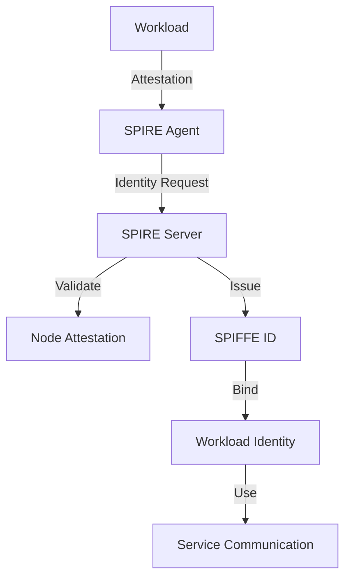
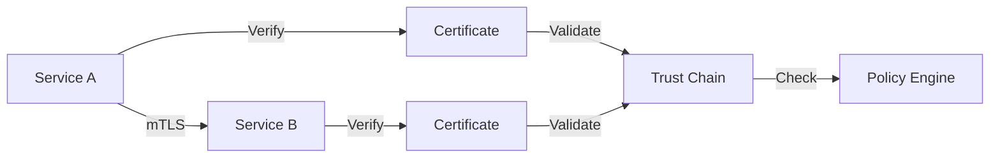
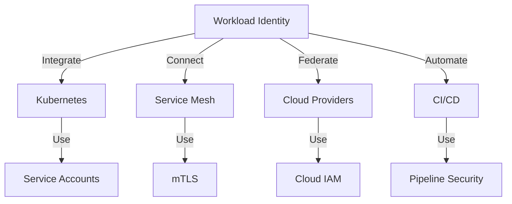

# Workload Identity System

## Introduction

This repository implements a comprehensive workload identity system designed for modern cloud-native environments. It provides a robust foundation for secure service-to-service communication, identity management, and access control in distributed systems. The system is built on the principles of zero-trust security, enabling organizations to implement strong authentication and authorization mechanisms across their infrastructure.

The workload identity system serves as a critical security component that:
- Assigns unique, cryptographically verifiable identities to each workload
- Enables secure, mutually authenticated communication between services
- Provides fine-grained access control based on workload identity
- Maintains comprehensive audit trails of service interactions
- Supports compliance requirements through built-in security controls
- Integrates with modern cloud platforms and container orchestration systems

Built with enterprise-grade security and reliability in mind, this system is designed to be:
- Production-ready with battle-tested security features
- Cloud-native and container-friendly
- Compliant with major security standards
- Extensible for custom integrations
- Observable with comprehensive monitoring

## Documentation

### Core Documentation
- [Architecture Guide](docs/architecture_guide.md) - System architecture and component interactions
- [Security Best Practices](docs/security_best_practices.md) - Security guidelines and implementation details
- [Developer Guide](docs/developer_guide.md) - Development workflows and best practices
- [Deployment Guide](docs/deployment_guide.md) - Deployment procedures and configurations
- [Monitoring Guide](docs/monitoring_guide.md) - Monitoring setup and observability practices
- [Disaster Recovery Guide](docs/disaster_recovery_guide.md) - Recovery procedures and backup strategies
- [API Reference Guide](docs/api_reference_guide.md) - API documentation and usage examples

### Migration and Compliance
- [Migration Guide](docs/migration_guide.md) - Migration procedures from existing systems
- [Compliance Guide](docs/compliance_guide.md) - Compliance requirements and implementation details
- [Troubleshooting Guide](docs/troubleshooting_guide.md) - Common issues and solutions

## Repository Structure

```
.
├── docs/                      # Documentation
├── infrastructure/           # Infrastructure as Code
│   ├── kubernetes/          # Kubernetes manifests
│   ├── terraform/          # Terraform configurations
│   └── ansible/            # Ansible playbooks
├── core/                   # Core libraries and utilities
├── services/              # Service implementations
└── examples/              # Example applications
```

## Key Features

### Identity Management
The system provides robust identity management capabilities through a distributed architecture that ensures secure and scalable workload identity provisioning. Each workload receives a unique SPIFFE ID that is cryptographically verifiable and tied to its runtime environment.



Key components:
- Automatic identity provisioning based on workload attributes
- Certificate-based authentication using X.509 certificates
- Role-based access control with fine-grained permissions
- Support for multiple identity providers through federation

### Security
The security architecture implements a zero-trust model where every service interaction requires mutual authentication and authorization. The system uses mTLS for secure communication and implements robust key management practices.



Security features:
- Mutual TLS (mTLS) for all service-to-service communication
- Zero-trust model implementation with continuous verification
- Secure key management with automatic rotation
- Hardware security module (HSM) support for key storage

### Integration
The system provides seamless integration with modern cloud-native platforms and tools, enabling organizations to implement workload identity across their entire infrastructure stack.



Integration capabilities:
- Native Kubernetes integration with service accounts
- Service mesh support for Istio and Linkerd
- Cloud provider integration (AWS, Azure, GCP)
- CI/CD pipeline integration for automated security

## Getting Started

### Prerequisites
- Kubernetes cluster (v1.19+)
- Helm v3
- kubectl
- Access to container registry

### Quick Start
1. Review the [Architecture Guide](docs/architecture_guide.md)
2. Follow the [Deployment Guide](docs/deployment_guide.md)
3. Consult the [Developer Guide](docs/developer_guide.md)
4. Refer to the [Security Best Practices](docs/security_best_practices.md)

### Basic Usage Example
```yaml
apiVersion: workload-identity/v1
kind: WorkloadIdentity
metadata:
  name: my-service
spec:
  serviceAccount: my-service-account
  identityProvider: kubernetes
  policies:
    - name: service-access
      rules:
        - apiGroups: ["*"]
          resources: ["*"]
          verbs: ["get", "list"]
```

## Migration

The system supports migration from various identity systems:
- OIDC to Workload Identity
- SAML to Workload Identity
- Custom identity system migration

See the [Migration Guide](docs/migration_guide.md) for detailed procedures.

## Compliance

Supports major compliance frameworks:
- ISO 27001
- SOC 2
- GDPR
- HIPAA

See the [Compliance Guide](docs/compliance_guide.md) for implementation details.

## Monitoring and Observability

Comprehensive monitoring capabilities:
- Metrics collection
- Log aggregation
- Alert management
- Performance monitoring

See the [Monitoring Guide](docs/monitoring_guide.md) for setup and configuration.

## License

This project is licensed under the Apache License 2.0 - see the [LICENSE](LICENSE) file for details.

## Acknowledgments

- SPIFFE/SPIRE community
- Open source contributors
- Security researchers
- Early adopters and testers 