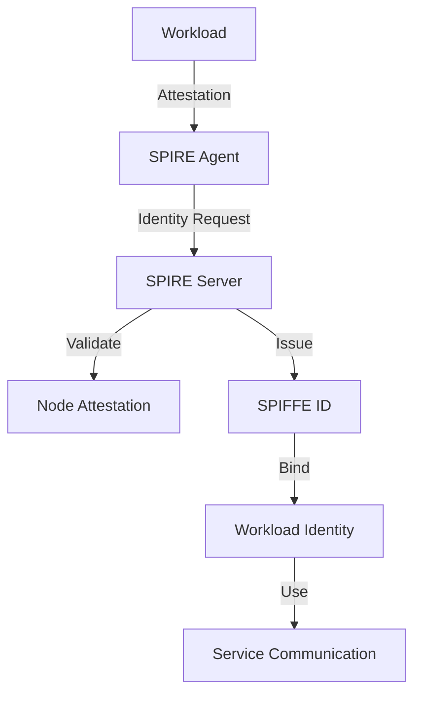
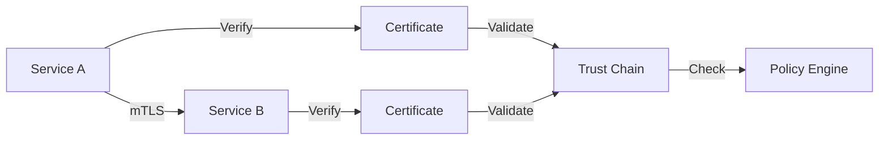
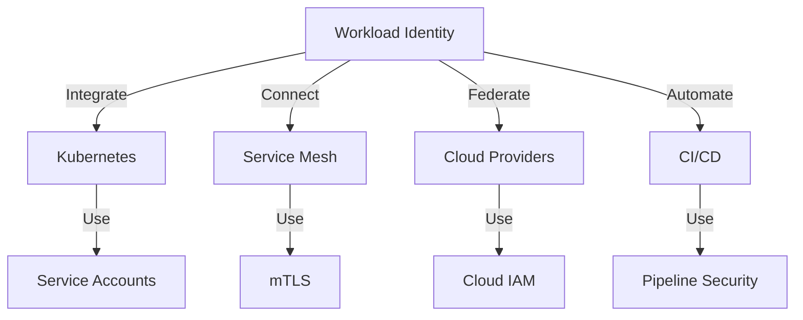

# Workload Identity System

## Introduction

This repository implements a comprehensive workload identity system designed for modern cloud-native environments. It provides a robust foundation for secure service-to-service communication, identity management, and access control in distributed systems. The system is built on the principles of zero-trust security, enabling organizations to implement strong authentication and authorization mechanisms across their infrastructure.

### Why Workload Identity?

In today's cloud-native and hyper-distributed architectures, identity is no longer a human-first problem. Workloads—containers, VMs, and serverless functions—must authenticate and authorize dynamically, with provable integrity and no static secrets. Workload identity assigns each non-human actor a unique, verifiable identifier (such as a [SPIFFE ID](https://spiffe.io/)), enabling secure, policy-driven communication at scale.

This evolution draws from decades of identity protocols—Kerberos, X.509, OAuth2, and OIDC—but is tailored to the demands of ephemeral infrastructure, zero trust models, and sovereign cloud environments. Trust becomes contextual and time-bound. This architecture embodies that shift.

## SPIFFE/SPIRE Implementation Review Checklist

### Core Components Review

#### 1. SPIRE Server (`infrastructure/kubernetes/spire/server.yaml`)
- [ ] Trust domain configuration matches organization's domain structure
- [ ] CA bundle and trust anchor configuration is secure
- [ ] Federation settings are properly configured
- [ ] High-availability settings are appropriate
- [ ] Resource limits and requests are set correctly
- [ ] Security context is properly configured
- [ ] Volume mounts for CA bundles and trust anchors are correct

#### 2. SPIRE Agent (`infrastructure/kubernetes/spire/agent.yaml`)
- [ ] Node attestation is properly configured
- [ ] Workload registration is set up correctly
- [ ] Integration with Kubernetes service accounts is working
- [ ] SPIFFE ID issuance is configured properly
- [ ] Security context and resource limits are appropriate
- [ ] Volume mounts for attestation data are correct

#### 3. Configuration (`infrastructure/kubernetes/spire/configmap.yaml`)
- [ ] Trust domain configuration is consistent
- [ ] Federation settings are properly configured
- [ ] Attestation configuration is correct
- [ ] Logging and monitoring settings are appropriate
- [ ] CA bundle and trust anchor settings are secure

#### 4. RBAC (`infrastructure/kubernetes/spire/rbac.yaml`)
- [ ] Roles and bindings follow least privilege principle
- [ ] Federation permissions are properly configured
- [ ] Trust anchor management permissions are secure
- [ ] Service account permissions are appropriate

### Federation and Trust

#### 5. Trust Bundle (`infrastructure/kubernetes/spire/trust-bundle.yaml`)
- [ ] Trust bundle configuration is correct
- [ ] Federation with external IdPs is properly configured
- [ ] CA bundle rotation is set up
- [ ] Failover settings are appropriate

#### 6. Federation (`infrastructure/kubernetes/spire/federation.yaml`)
- [ ] Federation configuration is correct
- [ ] Trust bundle exchange is properly configured
- [ ] Validation settings are appropriate
- [ ] Cross-domain trust is properly set up

### Security and Operations

#### 7. Secrets (`infrastructure/kubernetes/spire/secrets.yaml`)
- [ ] CA keys are properly secured
- [ ] Trust anchors are properly managed
- [ ] Encryption settings are appropriate
- [ ] Rotation procedures are configured

#### 8. Network Policy (`infrastructure/kubernetes/spire/network-policy.yaml`)
- [ ] Server-agent communication is properly secured
- [ ] Federation traffic is properly controlled
- [ ] Trust bundle exchange is secured
- [ ] Ingress/egress rules are appropriate

#### 9. Monitoring (`infrastructure/kubernetes/spire/monitoring.yaml`)
- [ ] Prometheus metrics are properly configured
- [ ] Grafana dashboards are set up
- [ ] Alerting rules are appropriate
- [ ] Federation health monitoring is configured

### Operational Readiness

#### 10. Health Checks (`infrastructure/kubernetes/spire/health.yaml`)
- [ ] Server health checks are configured
- [ ] Agent health checks are configured
- [ ] Federation health monitoring is set up
- [ ] Trust bundle health checks are configured

#### 11. Logging (`infrastructure/kubernetes/spire/logging.yaml`)
- [ ] Log levels are appropriate
- [ ] Log format is configured correctly
- [ ] Federation logs are properly captured
- [ ] Trust bundle logs are properly captured

### Disaster Recovery

#### 12. Backup (`infrastructure/kubernetes/spire/backup.yaml`)
- [ ] CA bundle backup is configured
- [ ] Trust anchor backup is configured
- [ ] Backup schedule is appropriate
- [ ] Retention policy is configured

#### 13. Upgrade (`infrastructure/kubernetes/spire/upgrade.yaml`)
- [ ] Upgrade procedures are documented
- [ ] CA bundle rotation during upgrades is configured
- [ ] Trust anchor rotation is configured
- [ ] Rollback procedures are documented

### Additional Considerations

#### 14. Attestation (`infrastructure/kubernetes/spire/attestation.yaml`)
- [ ] Node attestation is properly configured
- [ ] Workload attestation is set up correctly
- [ ] SPIFFE ID issuance is configured
- [ ] Validation settings are appropriate

#### 15. Volumes (`infrastructure/kubernetes/spire/volumes.yaml`)
- [ ] CA bundle storage is properly configured
- [ ] Trust anchor storage is properly configured
- [ ] Persistent storage is set up correctly
- [ ] Backup storage is configured

### Review Process

1. **Initial Review**
   - [ ] Review all configuration files for syntax and structure
   - [ ] Verify trust domain configuration
   - [ ] Check federation settings
   - [ ] Validate security configurations

2. **Security Review**
   - [ ] Verify RBAC configurations
   - [ ] Check network policies
   - [ ] Validate secret management
   - [ ] Review attestation settings

3. **Operational Review**
   - [ ] Verify monitoring setup
   - [ ] Check logging configuration
   - [ ] Validate health checks
   - [ ] Review backup procedures

4. **Integration Review**
   - [ ] Verify Kubernetes integration
   - [ ] Check service mesh integration
   - [ ] Validate cloud provider integration
   - [ ] Review CI/CD integration

5. **Documentation Review**
   - [ ] Verify README and documentation
   - [ ] Check configuration examples
   - [ ] Validate troubleshooting guides
   - [ ] Review security best practices

### Post-Review Actions

After completing the review, please provide feedback to the maintainer (salkimmich) regarding:

#### 1. Technical Implementation
- Areas where the implementation aligns with best practices
- Potential improvements in security architecture
- Scalability and performance considerations
- Integration points that could be enhanced
- Any technical debt or architectural concerns

#### 2. Documentation Quality
- Clarity and completeness of technical documentation
- Missing or unclear implementation details
- Areas where documentation could be enhanced
- Examples or use cases that would be helpful
- Any inconsistencies between documentation and implementation

#### 3. Operational Aspects
- Deployment and maintenance procedures
- Monitoring and observability setup
- Backup and recovery processes
- Configuration management approach
- Any operational concerns or suggestions

#### 4. Security and Compliance
- Security controls and their effectiveness
- Compliance implementation details
- Risk management approach
- Audit and logging capabilities
- Any security or compliance gaps identified

Please provide specific examples and recommendations where possible, focusing on actionable improvements that would enhance the system's security, reliability, and maintainability.

The workload identity system serves as a critical security component that:
- Assigns unique, cryptographically verifiable identities to each workload
- Enables secure, mutually authenticated communication between services
- Provides fine-grained access control based on workload identity
- Maintains comprehensive audit trails of service interactions
- Supports compliance requirements through built-in security controls
- Integrates with modern cloud platforms and container orchestration systems

Built with enterprise-grade security and reliability in mind, this system is designed to be:
- Production-ready with battle-tested security features
- Cloud-native and container-friendly
- Compliant with major security standards
- Extensible for custom integrations
- Observable with comprehensive monitoring

## Documentation

### Core Documentation
- [Architecture Guide](docs/architecture_guide.md) - System architecture and component interactions
- [Security Best Practices](docs/security_best_practices.md) - Security guidelines and implementation details
- [Developer Guide](docs/developer_guide.md) - Development workflows and best practices
- [Deployment Guide](docs/deployment_guide.md) - Deployment procedures and configurations
- [Monitoring Guide](docs/monitoring_guide.md) - Monitoring setup and observability practices
- [Disaster Recovery Guide](docs/disaster_recovery_guide.md) - Recovery procedures and backup strategies
- [API Reference Guide](docs/api_reference_guide.md) - API documentation and usage examples

### Migration and Compliance
- [Migration Guide](docs/migration_guide.md) - Migration procedures from existing systems
- [Compliance Guide](docs/compliance_guide.md) - Compliance requirements and implementation details
- [Troubleshooting Guide](docs/troubleshooting_guide.md) - Common issues and solutions

## Repository Structure

```
.
├── docs/                      # Documentation
│   ├── architecture_guide.md  # System architecture and design
│   ├── security_best_practices.md # Security guidelines
│   ├── developer_guide.md    # Development workflows
│   ├── deployment_guide.md   # Deployment procedures
│   ├── monitoring_guide.md   # Monitoring and observability
│   ├── disaster_recovery_guide.md # Recovery procedures
│   ├── api_reference.md      # API documentation
│   ├── migration_guide.md    # Migration procedures
│   ├── compliance_guide.md   # Compliance requirements
│   ├── troubleshooting_guide.md # Common issues
│   ├── pki_guide.md         # PKI concepts and usage
│   └── pki_concepts_detailed.md # Detailed PKI documentation
├── infrastructure/           # Infrastructure as Code
│   └── kubernetes/          # Kubernetes manifests
│       ├── spire/          # SPIRE server and agent configs
│       ├── monitoring/     # Monitoring stack configs
│       └── networking/     # Network policies and configs
├── core/                   # Core libraries and utilities
│   ├── identity/          # Identity management
│   ├── security/          # Security utilities
│   └── integration/       # Integration components
├── services/              # Service implementations
│   ├── identity-provider/ # Identity provider service
│   ├── policy-engine/     # Policy evaluation service
│   └── federation/        # Federation service
└── examples/              # Example applications
    ├── kubernetes/        # Kubernetes examples
    ├── cloud/            # Cloud provider examples
    └── service-mesh/     # Service mesh examples
```

### Key Directories Explained

#### Documentation (`docs/`)
The documentation directory contains comprehensive guides covering all aspects of the system:
- Architecture and design decisions
- Security best practices and guidelines
- Development workflows and standards
- Deployment procedures and configurations
- Monitoring and observability setup
- Disaster recovery procedures
- API reference and usage examples
- Migration procedures from existing systems
- Compliance requirements and implementation
- Troubleshooting guides
- PKI concepts and detailed documentation

#### Infrastructure (`infrastructure/`)
The infrastructure directory contains all infrastructure-as-code configurations:
- Kubernetes manifests for SPIRE deployment
- Monitoring stack configurations
- Network policies and security configurations
- (Planned) Terraform configurations for cloud resources
- (Planned) Ansible playbooks for automation

#### Core Libraries (`core/`)
The core directory contains the fundamental libraries and utilities:
- Identity management components
- Security utilities and helpers
- Integration components for various platforms
- Common utilities and shared code

#### Services (`services/`)
The services directory contains the main service implementations:
- Identity provider service for workload identity
- Policy engine for access control
- Federation service for cross-domain trust
- Additional supporting services

#### Examples (`examples/`)
The examples directory contains practical examples and templates:
- Kubernetes deployment examples
- Cloud provider integration examples
- Service mesh integration examples
- Common use case implementations

## Key Features

### Identity Management
The system provides robust identity management capabilities through a distributed architecture that ensures secure and scalable workload identity provisioning. Each workload receives a unique SPIFFE ID that is cryptographically verifiable and tied to its runtime environment.

Special Considerations:
- Ephemeral workloads require identity at runtime—not via pre-provisioned secrets
- Trust is anchored in secure enclaves, TPMs, or cloud-native CAs
- The system is designed for rapid scaling and horizontal expansion
- Supports both X.509 certificates and JWTs
- Enables decentralized issuance with centralized governance
- Federation-ready: supports trust bundles and multi-domain identity



Key components:
- Automatic identity provisioning based on workload attributes
- Certificate-based authentication using X.509 certificates
- Role-based access control with fine-grained permissions
- Support for multiple identity providers through federation

### Security
The security architecture implements a zero-trust model where every service interaction requires mutual authentication and authorization. The system uses mTLS for secure communication and implements robust key management practices.

Security Features:
- End-to-end mTLS with SPIFFE-based identities
- Continuous credential rotation (5–15 minute TTLs)
- Just-in-time identity provisioning and revocation
- Optional confidential computing integration (e.g. Intel SGX, AMD SEV)
- Real-time attestation: validate integrity of code and runtime environment

Temporal Governance:
- Trust is not just who a workload is—but when it is valid
- Time-bound credentials ensure credentials expire quickly, reducing lateral movement risk
- Policies can enforce access windows and runtime conditions via engines like OPA



Security features:
- Mutual TLS (mTLS) for all service-to-service communication
- Zero-trust model implementation with continuous verification
- Secure key management with automatic rotation
- Hardware security module (HSM) support for key storage

### Integration
The system provides seamless integration with modern cloud-native platforms and tools, enabling organizations to implement workload identity across their entire infrastructure stack.

Integration capabilities:
- Kubernetes: Uses native ServiceAccount tokens for OIDC federation
- Cloud IAM: Compatible with AWS IRSA, GCP Workload Identity, Azure Federated Identity Credentials
- Service Mesh: Works with Istio, Linkerd, and custom mTLS setups
- CI/CD: Secure ephemeral identity for GitHub Actions, GitLab, Jenkins, and more
- Secrets Managers: Authenticate to systems like Vault using ambient SPIFFE identity



## Getting Started

### Prerequisites
- Kubernetes cluster (v1.19+)
- Helm v3
- kubectl
- Access to container registry

### Quick Start
1. Review the [Architecture Guide](docs/architecture_guide.md)
2. Follow the [Deployment Guide](docs/deployment_guide.md)
3. Consult the [Developer Guide](docs/developer_guide.md)
4. Refer to the [Security Best Practices](docs/security_best_practices.md)

### Development Workflow

#### 1. Local Development Setup
```bash
# Clone the repository
git clone https://github.com/your-org/workload-identity.git
cd workload-identity

# Set up development environment
make setup-dev

# Start local development cluster
make start-local-cluster

# Run tests
make test
```

#### 2. Component Development
The system is organized into several key components:

1. **Identity Provider**
   - Located in `services/identity-provider/`
   - Handles workload identity issuance and validation
   - Implements SPIFFE/SPIRE integration
   - Manages trust relationships

2. **Policy Engine**
   - Located in `services/policy-engine/`
   - Evaluates access control policies
   - Integrates with OPA for policy decisions
   - Manages policy lifecycle

3. **Federation Service**
   - Located in `services/federation/`
   - Handles cross-domain trust
   - Manages trust bundle exchange
   - Implements federation protocols

#### 3. Testing Strategy
- Unit tests for core components
- Integration tests for service interactions
- End-to-end tests for complete workflows
- Security tests for trust relationships
- Performance tests for scalability

#### 4. Deployment Process
1. Build components:
   ```bash
   make build
   ```

2. Run tests:
   ```bash
   make test
   ```

3. Build containers:
   ```bash
   make docker-build
   ```

4. Deploy to cluster:
   ```bash
   make deploy
   ```

#### 5. Monitoring and Debugging
- Use the monitoring stack for observability
- Check logs using the logging system
- Use tracing for request flows
- Monitor metrics for performance

#### 6. Contributing
1. Create a feature branch
2. Make your changes
3. Run tests and linting
4. Submit a pull request
5. Address review comments
6. Merge after approval

For more details, see the [Developer Guide](docs/developer_guide.md).

### Basic Usage Example
```yaml
apiVersion: workload-identity/v1
kind: WorkloadIdentity
metadata:
  name: my-service
spec:
  serviceAccount: my-service-account
  identityProvider: kubernetes
  policies:
    - name: service-access
      rules:
        - apiGroups: ["*"]
          resources: ["*"]
          verbs: ["get", "list"]
```

## Migration

The system supports migration from various identity systems:
- OIDC to Workload Identity
- SAML to Workload Identity
- Custom identity system migration

See the [Migration Guide](docs/migration_guide.md) for detailed procedures.

## Compliance

Supports major compliance frameworks:
- ISO 27001
- SOC 2
- GDPR
- HIPAA

See the [Compliance Guide](docs/compliance_guide.md) for implementation details.

## Monitoring and Observability

The system provides comprehensive monitoring and observability capabilities through a modern observability stack:

### Monitoring Stack
```yaml
monitoring:
  metrics:
    prometheus:
      enabled: true
      retention: 15d
      scrape_interval: 15s
  logging:
    loki:
      enabled: true
      retention: 30d
  tracing:
    jaeger:
      enabled: true
      sampling_rate: 0.1
```

### Key Metrics
1. **Identity Metrics**
   - Identity issuance rate
   - Identity validation success/failure
   - Certificate rotation events
   - Trust bundle updates

2. **Security Metrics**
   - Authentication attempts
   - Authorization decisions
   - Policy evaluation latency
   - Security violations

3. **Performance Metrics**
   - Request latency
   - Error rates
   - Resource utilization
   - Cache hit rates

4. **Federation Metrics**
   - Cross-domain trust operations
   - Trust bundle exchange events
   - Federation health status
   - Federation latency

### Logging
- Structured logging in JSON format
- Log levels: DEBUG, INFO, WARN, ERROR
- Log rotation and retention
- Log aggregation and analysis

### Tracing
- Distributed tracing with OpenTelemetry
- Request flow visualization
- Latency analysis
- Error tracking

### Dashboards
1. **System Overview**
   - System health
   - Resource utilization
   - Error rates
   - Performance metrics

2. **Security Dashboard**
   - Authentication metrics
   - Authorization decisions
   - Security events
   - Policy evaluations

3. **Federation Dashboard**
   - Trust relationships
   - Federation health
   - Cross-domain operations
   - Trust bundle status

### Alerting
1. **Critical Alerts**
   - System failures
   - Security violations
   - Trust chain issues
   - Federation failures

2. **Warning Alerts**
   - High latency
   - Error rate spikes
   - Resource constraints
   - Certificate expiration

3. **Info Alerts**
   - Configuration changes
   - Policy updates
   - Trust bundle updates
   - Federation events

For detailed setup and configuration, see the [Monitoring Guide](docs/monitoring_guide.md).

## License

This project is licensed under the Apache License 2.0 - see the [LICENSE](LICENSE) file for details.

## Acknowledgments

- SPIFFE/SPIRE community
- Open source contributors
- Security researchers
- Early adopters and testers

## Future Considerations
As software shifts from static services to autonomous, agentic systems, workload identity will become the foundation of runtime trust. In these architectures:
- Identity must be ephemeral and context-aware
- Trust must be verifiable and bound by time
- Remote attestation must prove not just who a workload is, but why we trust its actions

This system is designed as a platform to support that evolution.

## Senior Engineer Review Guide

### Critical Files to Review

#### 1. Core Implementation Files
- `core/identity/manager.go` - Core identity management logic
- `core/security/crypto.go` - Cryptographic operations and key management
- `core/integration/kubernetes.go` - Kubernetes integration implementation
- `services/identity-provider/main.go` - Identity provider service implementation
- `services/policy-engine/evaluator.go` - Policy evaluation engine
- `infrastructure/kubernetes/spire/server.yaml` - SPIRE server configuration
- `infrastructure/kubernetes/spire/agent.yaml` - SPIRE agent configuration

#### 2. Security-Critical Files
- `core/security/tls.go` - TLS configuration and certificate management
- `core/security/auth.go` - Authentication and authorization logic
- `core/security/audit.go` - Audit logging implementation
- `infrastructure/kubernetes/spire/secrets.yaml` - Secret management
- `infrastructure/kubernetes/spire/network-policy.yaml` - Network security policies

#### 3. Configuration Files
- `infrastructure/kubernetes/spire/configmap.yaml` - Core configuration
- `infrastructure/kubernetes/spire/trust-bundle.yaml` - Trust domain configuration
- `infrastructure/kubernetes/spire/federation.yaml` - Federation settings
- `infrastructure/kubernetes/monitoring/prometheus.yaml` - Monitoring configuration

### Essential Documentation Review

#### 1. Architecture and Design
- [Architecture Guide](docs/architecture_guide.md) - System design and component interactions
- [Security Best Practices](docs/security_best_practices.md) - Security implementation details
- [PKI Guide](docs/pki_guide.md) - Certificate management and PKI concepts
- [API Reference](docs/api_reference.md) - API design and implementation

#### 2. Operational Documentation
- [Deployment Guide](docs/deployment_guide.md) - Deployment architecture and procedures
- [Monitoring Guide](docs/monitoring_guide.md) - Observability and monitoring
- [Disaster Recovery Guide](docs/disaster_recovery_guide.md) - Recovery procedures
- [Compliance Guide](docs/compliance_guide.md) - Compliance implementation

### Review Checklist

#### 1. Security Architecture
- [ ] Zero Trust principles implementation
- [ ] Cryptographic implementation review
- [ ] Authentication and authorization flows
- [ ] Secret management approach
- [ ] Network security controls
- [ ] Audit logging implementation

#### 2. Scalability and Performance
- [ ] Horizontal scaling capabilities
- [ ] Performance bottlenecks
- [ ] Resource utilization
- [ ] Caching strategies
- [ ] Rate limiting implementation

#### 3. Reliability and Resilience
- [ ] High availability design
- [ ] Fault tolerance mechanisms
- [ ] Disaster recovery procedures
- [ ] Backup and restore capabilities
- [ ] State management approach

#### 4. Integration Points
- [ ] Kubernetes integration
- [ ] Service mesh compatibility
- [ ] Cloud provider integration
- [ ] External identity providers
- [ ] Monitoring and logging systems

#### 5. Operational Considerations
- [ ] Deployment strategies
- [ ] Configuration management
- [ ] Monitoring and alerting
- [ ] Logging and tracing
- [ ] Maintenance procedures

### Key Areas of Focus

#### 1. Security Implementation
- Review cryptographic implementations for best practices
- Verify secure key management and rotation
- Check authentication and authorization flows
- Validate audit logging and monitoring
- Assess network security controls

#### 2. Architecture Design
- Evaluate component interactions
- Review scalability considerations
- Check fault tolerance mechanisms
- Verify high availability design
- Assess integration patterns

#### 3. Operational Excellence
- Review deployment procedures
- Check monitoring implementation
- Verify backup and recovery
- Assess maintenance procedures
- Validate configuration management

#### 4. Compliance and Standards
- Review security standards compliance
- Check audit requirements
- Verify documentation completeness
- Assess policy implementation
- Validate control effectiveness

### Post-Review Actions

#### 1. Documentation Updates
- Update architecture documentation
- Enhance security guidelines
- Improve operational procedures
- Add troubleshooting guides
- Update compliance documentation

#### 2. Implementation Improvements
- Address security findings
- Enhance scalability features
- Improve monitoring capabilities
- Strengthen disaster recovery
- Optimize performance

#### 3. Operational Enhancements
- Improve deployment procedures
- Enhance monitoring setup
- Strengthen backup procedures
- Optimize maintenance tasks
- Update security controls

### Additional Resources

#### 1. Standards and Best Practices
- [SPIFFE/SPIRE Documentation](https://spiffe.io/docs/latest/)
- [NIST Zero Trust Architecture](https://nvlpubs.nist.gov/nistpubs/SpecialPublications/NIST.SP.800-207.pdf)
- [OWASP Security Guidelines](https://owasp.org/www-project-top-ten/)
- [Kubernetes Security Best Practices](https://kubernetes.io/docs/concepts/security/)

#### 2. Reference Implementations
- [SPIRE Reference Architecture](https://github.com/spiffe/spire)
- [Istio Security](https://istio.io/latest/docs/concepts/security/)
- [Kubernetes Security](https://kubernetes.io/docs/concepts/security/)

#### 3. Tools and Utilities
- [SPIFFE Workload API](https://github.com/spiffe/go-spiffe)
- [SPIRE Agent](https://github.com/spiffe/spire/tree/main/doc/spire_agent)
- [SPIRE Server](https://github.com/spiffe/spire/tree/main/doc/spire_server) 