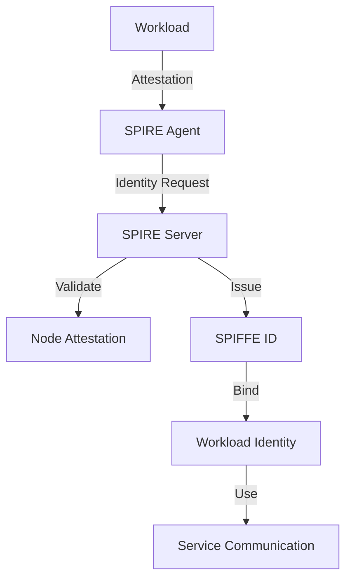
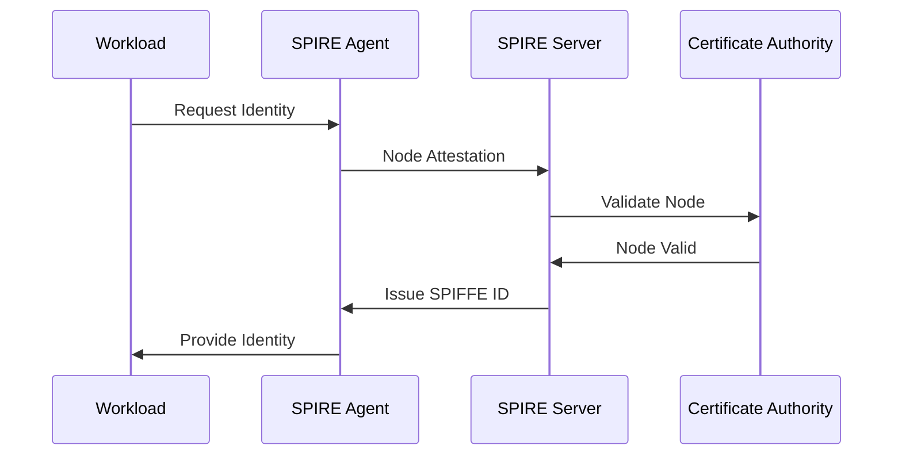
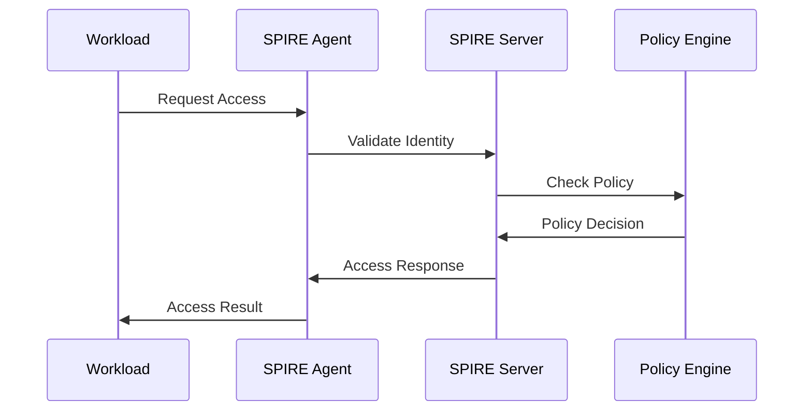

# Workload Identity Architecture Guide

This document provides a detailed overview of the Workload Identity system architecture, its components, and their interactions. The architecture is designed with Zero Trust principles at its core, implementing "never trust, always verify" across all components and interactions.

## Table of Contents
1. [System Overview](#system-overview)
2. [Core Components](#core-components)
3. [Security Boundaries](#security-boundaries)
4. [Data Flow](#data-flow)
5. [Integration Points](#integration-points)
6. [High Availability](#high-availability)
7. [Scaling Considerations](#scaling-considerations)
8. [Zero Trust Implementation](#zero-trust-implementation)
9. [Security Hardening](#security-hardening)
10. [Observability and Audit](#observability-and-audit)

## System Overview

### Architecture Diagram


### Key Concepts

1. **SPIRE Server**
   - Central identity provider
   - Certificate authority
   - Policy enforcement
   - Audit logging
   - High availability
   - Secure storage

2. **SPIRE Agent**
   - Node attestation
   - Workload registration
   - Certificate distribution
   - Health monitoring
   - Security context
   - Resource management

3. **Workload Identity**
   - SPIFFE ID
   - X.509 certificates
   - JWT tokens
   - mTLS support
   - Automatic rotation
   - Zero Trust alignment

## Core Components

### 1. SPIRE Server
```yaml
# Example SPIRE Server Configuration
spire_server:
  deployment:
    replicas: 3
    strategy:
      type: RollingUpdate
      rollingUpdate:
        maxSurge: 1
        maxUnavailable: 0
    securityContext:
      runAsNonRoot: true
      runAsUser: 1000
      runAsGroup: 1000
      fsGroup: 1000
    resources:
      requests:
        cpu: "100m"
        memory: "128Mi"
      limits:
        cpu: "500m"
        memory: "512Mi"
    volumes:
      - name: spire-server-certs
        secret:
          secretName: spire-server-certs
      - name: spire-server-config
        configMap:
          name: spire-server-config
```

### 2. SPIRE Agent
```yaml
# Example SPIRE Agent Configuration
spire_agent:
  daemonSet:
    updateStrategy:
      type: RollingUpdate
      rollingUpdate:
        maxUnavailable: 1
    securityContext:
      runAsNonRoot: true
      runAsUser: 1000
      runAsGroup: 1000
      fsGroup: 1000
    resources:
      requests:
        cpu: "50m"
        memory: "64Mi"
      limits:
        cpu: "200m"
        memory: "256Mi"
    volumes:
      - name: spire-agent-certs
        secret:
          secretName: spire-agent-certs
      - name: spire-agent-config
        configMap:
          name: spire-agent-config
```

### 3. Certificate Management
```yaml
# Example Certificate Management Configuration
certificate_management:
  root_ca:
    validity: 3650d
    key_size: 4096
    hsm_backed: true
  intermediate_ca:
    validity: 1825d
    key_size: 4096
    hsm_backed: true
  workload_certs:
    validity: 24h
    key_size: 2048
    rotation:
      automatic: true
      interval: 12h
      grace_period: 1h
```

## Security Boundaries

### 1. Network Security
```yaml
# Example Network Security Configuration
network_security:
  ingress:
    allowed_ports: [443]
    allowed_protocols: ["tls"]
  egress:
    allowed_destinations: ["*.internal"]
    proxy_required: true
```

### 2. Access Control
```yaml
# Example Access Control Configuration
access_control:
  authentication:
    required: true
    methods: ["mtls", "jwt"]
  authorization:
    default_deny: true
    audit_logging: true
```

### 3. Data Protection
```yaml
# Example Data Protection Configuration
data_protection:
  encryption:
    at_rest: "aes-256-gcm"
    in_transit: "tls-1.3"
  key_rotation:
    automatic: true
    interval: 24h
```

## Data Flow

### 1. Authentication Flow


### 2. Authorization Flow


## Integration Points

### 1. Kubernetes Integration
```yaml
# Example Kubernetes Integration Configuration
kubernetes_integration:
  service_account:
    token_review: true
    audience: ["spire"]
  node_attestation:
    type: "k8s_psat"
    cluster: "default"
  workload_attestation:
    type: "k8s"
    namespace: "default"
```

### 2. Service Mesh Integration
```yaml
# Example Service Mesh Integration Configuration
service_mesh_integration:
  type: "istio"
  mtls:
    enabled: true
    mode: "STRICT"
  trust_domain:
    name: "spiffe://example.org"
    bundle: "spire-bundle"
```

## High Availability

### 1. SPIRE Server HA
```yaml
# Example SPIRE Server HA Configuration
high_availability:
  server:
    replicas: 3
    strategy: RollingUpdate
    persistence:
      type: "etcd"
      endpoints:
        - "etcd-0:2379"
        - "etcd-1:2379"
        - "etcd-2:2379"
    backup:
      enabled: true
      interval: 1h
      retention: 7d
```

### 2. SPIRE Agent HA
```yaml
# Example SPIRE Agent HA Configuration
high_availability:
  agent:
    updateStrategy: RollingUpdate
    maxUnavailable: 1
    healthCheck:
      initialDelay: 5s
      period: 10s
      timeout: 3s
      failureThreshold: 3
```

## Scaling Considerations

### 1. Horizontal Scaling
```yaml
# Example Horizontal Scaling Configuration
scaling:
  server:
    minReplicas: 3
    maxReplicas: 10
    targetCPUUtilization: 70
    targetMemoryUtilization: 80
  agent:
    maxAgentsPerNode: 1
    resourceLimits:
      cpu: "200m"
      memory: "256Mi"
```

### 2. Performance Optimization
```yaml
# Example Performance Optimization Configuration
performance:
  caching:
    enabled: true
    size: 1000
    ttl: 5m
  rate_limiting:
    enabled: true
    requests_per_second: 100
    burst: 200
```

## Zero Trust Implementation

### 1. Identity Verification
```yaml
# Example Identity Verification Configuration
identity_verification:
  continuous: true
  methods:
    - "mtls"
    - "jwt"
    - "spiffe"
  validation:
    strict: true
    audit: true
```

### 2. Access Control
```yaml
# Example Access Control Configuration
access_control:
  zero_trust:
    enabled: true
    default_deny: true
    continuous_verification: true
    least_privilege: true
```

## Security Hardening

### 1. Runtime Security
```yaml
# Example Runtime Security Configuration
runtime_security:
  containers:
    readOnlyRootFilesystem: true
    allowPrivilegeEscalation: false
    runAsNonRoot: true
    capabilities:
      drop:
        - "ALL"
  network:
    policy:
      ingress: []
      egress: []
```

### 2. Certificate Security
```yaml
# Example Certificate Security Configuration
certificate_security:
  rotation:
    automatic: true
    interval: 12h
    grace_period: 1h
  storage:
    encryption: "aes-256-gcm"
    backup: true
    retention: 30d
```

## Observability and Audit

### 1. Monitoring
```yaml
# Example Monitoring Configuration
monitoring:
  metrics:
    enabled: true
    port: 9090
    path: "/metrics"
  logging:
    level: "info"
    format: "json"
    output: "stdout"
  tracing:
    enabled: true
    sampling: 0.1
```

### 2. Audit Logging
```yaml
# Example Audit Logging Configuration
audit_logging:
  enabled: true
  format: "json"
  output: "stdout"
  events:
    - "identity.issued"
    - "identity.revoked"
    - "access.granted"
    - "access.denied"
```

## Conclusion

This architecture guide provides a comprehensive overview of the workload identity system. The system is designed to be:
- Secure: Implements Zero Trust principles
- Scalable: Supports horizontal scaling
- Reliable: Includes high availability
- Observable: Provides comprehensive monitoring
- Compliant: Follows security best practices

For additional information, refer to:
- [Security Best Practices](security_best_practices.md)
- [Deployment Guide](deployment_guide.md)
- [Developer Guide](developer_guide.md)
- [API Reference](api_reference.md) 