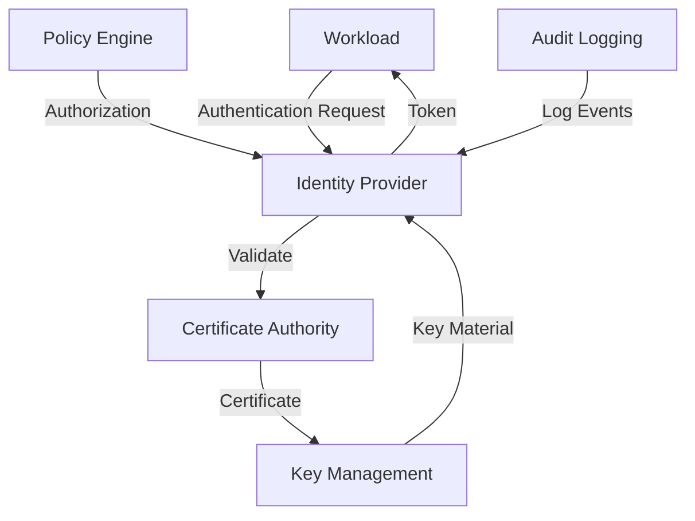
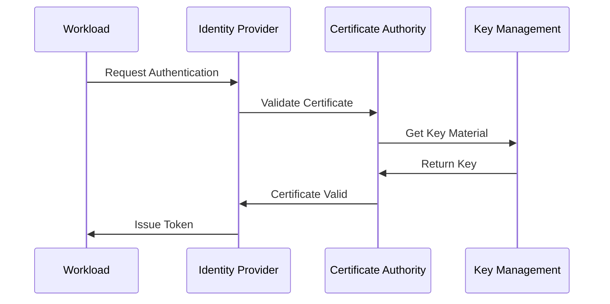
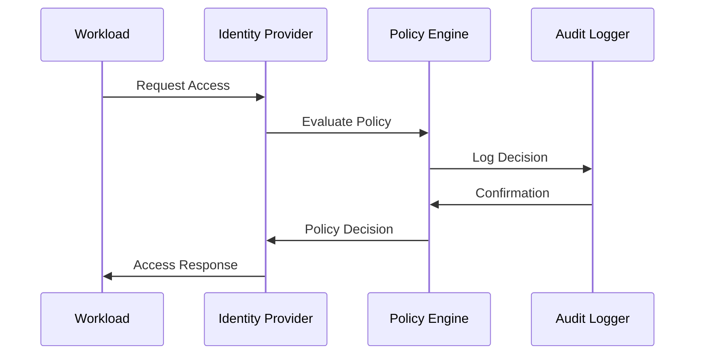

# Workload Identity Architecture Guide

This document provides a detailed overview of the Workload Identity system architecture, its components, and their interactions.

## Table of Contents
1. [System Overview](#system-overview)
2. [Core Components](#core-components)
3. [Security Boundaries](#security-boundaries)
4. [Data Flow](#data-flow)
5. [Integration Points](#integration-points)
6. [High Availability](#high-availability)
7. [Scaling Considerations](#scaling-considerations)

## System Overview

### Architecture Diagram


### Key Concepts
- **Workload**: Any application, service, or process requiring identity. This includes:
  - Microservices
  - Batch jobs
  - Scheduled tasks
  - Serverless functions
  - Containerized applications

- **Identity Provider**: Manages workload identities and authentication:
  - Issues and validates identity tokens
  - Manages workload registration
  - Handles authentication flows
  - Integrates with various identity sources

- **Certificate Authority**: Issues and validates digital certificates:
  - Manages certificate lifecycle
  - Maintains certificate revocation
  - Handles certificate chain validation
  - Supports multiple certificate types

- **Key Management**: Secures and manages cryptographic keys:
  - Stores private keys securely
  - Handles key rotation
  - Manages key access policies
  - Supports multiple key types

- **Policy Engine**: Enforces access control policies:
  - Evaluates access requests
  - Manages policy rules
  - Handles policy distribution
  - Supports multiple policy languages

- **Audit Logging**: Records security-relevant events:
  - Authentication attempts
  - Authorization decisions
  - Policy changes
  - System events

## Core Components

### 1. Identity Provider
```yaml
# Example Identity Provider Configuration
identity_provider:
  type: "kubernetes"  # Options: kubernetes, aws, azure, gcp
  authentication:
    method: "mtls"
    token_lifetime: 3600
  authorization:
    policy_source: "file"
    cache_ttl: 300
```

#### Responsibilities
- **Authentication**:
  - Validates workload credentials
  - Issues identity tokens
  - Manages token lifecycle
  - Supports multiple auth methods

- **Identity Management**:
  - Registers new workloads
  - Updates identity attributes
  - Handles identity lifecycle
  - Manages identity metadata

- **Token Management**:
  - Issues JWT tokens
  - Validates token signatures
  - Handles token revocation
  - Manages token expiration

- **Integration**:
  - Connects to identity sources
  - Supports multiple protocols
  - Handles federation
  - Manages trust relationships

### 2. Certificate Authority
```yaml
# Example CA Configuration
certificate_authority:
  type: "internal"  # Options: internal, external
  hierarchy:
    root_ca:
      validity: 3650d
      key_size: 4096
    intermediate_ca:
      validity: 1825d
      key_size: 4096
```

#### Responsibilities
- **Certificate Management**:
  - Issues new certificates
  - Validates certificate chains
  - Manages certificate lifecycle
  - Handles certificate revocation

- **Key Management**:
  - Generates key pairs
  - Manages key rotation
  - Secures private keys
  - Handles key backup

- **Trust Management**:
  - Maintains trust anchors
  - Manages trust relationships
  - Handles cross-certification
  - Supports multiple trust models

- **Compliance**:
  - Maintains audit logs
  - Handles compliance reporting
  - Manages policy enforcement
  - Supports regulatory requirements

### 3. Key Management
```yaml
# Example Key Management Configuration
key_management:
  storage:
    type: "hsm"  # Options: hsm, kms, file
    encryption: "aes-256-gcm"
  rotation:
    interval: 24h
    grace_period: 1h
```

#### Responsibilities
- **Key Storage**:
  - Secures private keys
  - Manages key access
  - Handles key backup
  - Supports multiple storage types

- **Key Operations**:
  - Generates new keys
  - Rotates existing keys
  - Signs operations
  - Manages key lifecycle

- **Access Control**:
  - Enforces key policies
  - Manages permissions
  - Handles authentication
  - Supports audit logging

- **Integration**:
  - Connects to HSMs
  - Supports cloud KMS
  - Handles key import/export
  - Manages key distribution

### 4. Policy Engine
```yaml
# Example Policy Engine Configuration
policy_engine:
  evaluation:
    mode: "rego"  # Options: rego, json
    cache_size: 1000
  rules:
    source: "git"
    update_interval: 5m
```

#### Responsibilities
- **Policy Evaluation**:
  - Evaluates access requests
  - Applies policy rules
  - Handles policy conflicts
  - Manages decision caching

- **Rule Management**:
  - Stores policy rules
  - Updates rule sets
  - Manages rule versions
  - Handles rule distribution

- **Access Control**:
  - Enforces policies
  - Manages permissions
  - Handles role-based access
  - Supports attribute-based access

- **Integration**:
  - Connects to policy sources
  - Supports multiple formats
  - Handles policy updates
  - Manages policy distribution

## Security Boundaries

### 1. Network Security
```yaml
# Example Network Security Configuration
network_security:
  ingress:
    allowed_ports: [443]
    allowed_protocols: ["tls"]
  egress:
    allowed_destinations: ["*.internal"]
    proxy_required: true
```

#### Implementation Details
- **TLS Configuration**:
  - Enforces TLS 1.3
  - Manages certificate validation
  - Handles cipher suites
  - Supports mutual TLS

- **Network Policies**:
  - Controls traffic flow
  - Manages access rules
  - Handles network isolation
  - Supports service mesh

- **Firewall Rules**:
  - Restricts access
  - Manages ports
  - Handles protocols
  - Supports segmentation

### 2. Access Control
```yaml
# Example Access Control Configuration
access_control:
  authentication:
    required: true
    methods: ["mtls", "jwt"]
  authorization:
    default_deny: true
    audit_logging: true
```

#### Implementation Details
- **Authentication**:
  - Enforces strong auth
  - Manages credentials
  - Handles multi-factor
  - Supports federation

- **Authorization**:
  - Enforces policies
  - Manages permissions
  - Handles roles
  - Supports attributes

- **Audit Logging**:
  - Records events
  - Manages logs
  - Handles retention
  - Supports analysis

### 3. Data Protection
```yaml
# Example Data Protection Configuration
data_protection:
  encryption:
    at_rest: "aes-256-gcm"
    in_transit: "tls-1.3"
  key_rotation:
    automatic: true
    interval: 24h
```

#### Implementation Details
- **Encryption**:
  - Secures data at rest
  - Protects data in transit
  - Manages keys
  - Handles algorithms

- **Key Management**:
  - Rotates keys
  - Manages lifecycle
  - Handles backup
  - Supports recovery

- **Data Handling**:
  - Classifies data
  - Manages access
  - Handles retention
  - Supports compliance

## Data Flow

### 1. Authentication Flow


#### Flow Details
1. **Authentication Request**:
   - Workload initiates auth
   - Presents credentials
   - Requests token
   - Handles response

2. **Certificate Validation**:
   - Validates chain
   - Checks revocation
   - Verifies signature
   - Confirms trust

3. **Key Material**:
   - Retrieves keys
   - Validates access
   - Handles rotation
   - Manages lifecycle

4. **Token Issuance**:
   - Generates token
   - Signs token
   - Sets expiration
   - Returns token

### 2. Authorization Flow


#### Flow Details
1. **Access Request**:
   - Workload requests access
   - Presents token
   - Specifies resource
   - Handles response

2. **Policy Evaluation**:
   - Loads policies
   - Evaluates rules
   - Checks permissions
   - Makes decision

3. **Audit Logging**:
   - Records request
   - Logs decision
   - Stores context
   - Handles retention

4. **Access Response**:
   - Returns decision
   - Provides context
   - Handles errors
   - Manages caching

## Integration Points

### 1. Cloud Providers
```yaml
# Example Cloud Provider Integration
cloud_integration:
  aws:
    iam_role: "workload-identity"
    region: "us-west-2"
  gcp:
    service_account: "workload-identity@project"
    project: "example-project"
  azure:
    managed_identity: "workload-identity"
    subscription: "example-sub"
```

#### Integration Details
- **AWS Integration**:
  - Uses IAM roles
  - Manages permissions
  - Handles federation
  - Supports STS

- **GCP Integration**:
  - Uses service accounts
  - Manages IAM
  - Handles workload identity
  - Supports federation

- **Azure Integration**:
  - Uses managed identities
  - Manages RBAC
  - Handles federation
  - Supports AAD

### 2. Container Platforms
```yaml
# Example Container Platform Integration
container_integration:
  kubernetes:
    service_account:
      name: "workload-identity"
      namespace: "default"
    webhook:
      enabled: true
      path: "/mutate"
```

#### Integration Details
- **Kubernetes Integration**:
  - Uses service accounts
  - Manages RBAC
  - Handles webhooks
  - Supports CSI

- **OpenShift Integration**:
  - Uses service accounts
  - Manages SCC
  - Handles OAuth
  - Supports operators

### 3. Service Mesh
```yaml
# Example Service Mesh Integration
service_mesh:
  istio:
    mtls:
      mode: "STRICT"
    authorization:
      policy: "workload-identity"
```

#### Integration Details
- **Istio Integration**:
  - Uses mTLS
  - Manages policies
  - Handles auth
  - Supports WASM

- **Linkerd Integration**:
  - Uses mTLS
  - Manages policies
  - Handles auth
  - Supports extensions

## High Availability

### 1. Component Redundancy
```yaml
# Example HA Configuration
high_availability:
  identity_provider:
    replicas: 3
    strategy: "active-active"
  certificate_authority:
    replicas: 2
    strategy: "active-passive"
  key_management:
    replicas: 2
    strategy: "active-passive"
```

#### HA Details
- **Identity Provider**:
  - Multiple replicas
  - Load balancing
  - Session replication
  - Failover handling

- **Certificate Authority**:
  - Primary/backup
  - State replication
  - Failover automation
  - Recovery procedures

- **Key Management**:
  - HSM redundancy
  - Key replication
  - Failover handling
  - Recovery procedures

### 2. Data Replication
```yaml
# Example Data Replication Configuration
data_replication:
  mode: "synchronous"
  consistency: "strong"
  backup:
    frequency: "1h"
```

#### Replication Details
- **Database Replication**:
  - Synchronous replication
  - Consistency levels
  - Failover handling
  - Recovery procedures

- **Key Replication**:
  - HSM replication
  - Key distribution
  - State synchronization
  - Recovery procedures

## Scaling Considerations

### 1. Horizontal Scaling
```yaml
# Example Scaling Configuration
scaling:
  identity_provider:
    min_replicas: 3
    max_replicas: 10
    metrics:
      - "cpu_usage"
      - "memory_usage"
  policy_engine:
    min_replicas: 2
    max_replicas: 5
    metrics:
      - "request_latency"
      - "policy_evaluation_time"
```

#### Scaling Details
- **Identity Provider**:
  - Stateless scaling
  - Load distribution
  - Session handling
  - Cache management

- **Policy Engine**:
  - Rule distribution
  - Cache replication
  - State management
  - Performance optimization

### 2. Performance Optimization
```yaml
# Example Performance Configuration
performance:
  caching:
    token_cache:
      size: "1GB"
      ttl: "5m"
    policy_cache:
      size: "500MB"
      ttl: "1m"
  connection_pooling:
    database:
      min_connections: 10
      max_connections: 100
    ldap:
      min_connections: 5
      max_connections: 50
```

#### Optimization Details
- **Caching Strategy**:
  - Token caching
  - Policy caching
  - Certificate caching
  - State caching

- **Connection Management**:
  - Connection pooling
  - Resource limits
  - Timeout handling
  - Error recovery

## Conclusion

This guide provides comprehensive architecture details for the workload identity system. Remember to:
- Follow security best practices
- Implement high availability
- Plan for scaling
- Monitor performance
- Maintain documentation

For additional information, refer to:
- [Security Best Practices](security_best_practices.md)
- [Deployment Guide](deployment_guide.md)
- [Monitoring Guide](monitoring_guide.md) 