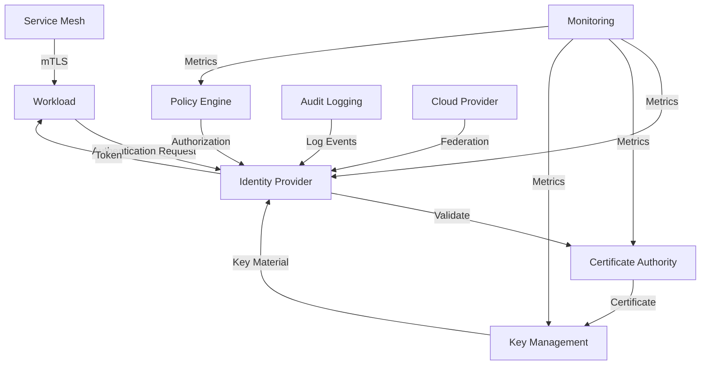
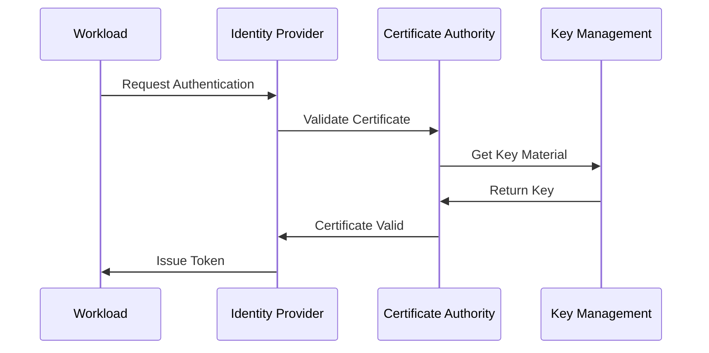
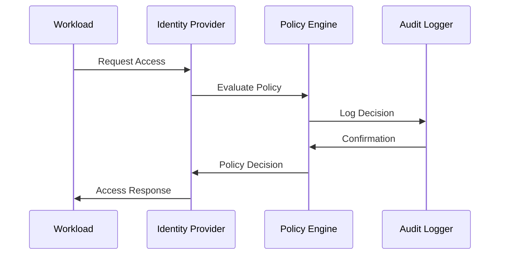

# Workload Identity Architecture Guide

This document provides a detailed overview of the Workload Identity system architecture, its components, and their interactions. The architecture is designed with Zero Trust principles at its core, implementing "never trust, always verify" across all components and interactions.

## Table of Contents
1. [System Overview](#system-overview)
2. [Core Components](#core-components)
3. [Security Boundaries](#security-boundaries)
4. [Data Flow](#data-flow)
5. [Integration Points](#integration-points)
6. [High Availability](#high-availability)
7. [Scaling Considerations](#scaling-considerations)
8. [Zero Trust Implementation](#zero-trust-implementation)
9. [Security Hardening](#security-hardening)
10. [Observability and Audit](#observability-and-audit)

## System Overview

### Architecture Diagram


### Key Concepts
- **Workload**: Any application, service, or process requiring identity. This includes:
  - Microservices
  - Batch jobs
  - Scheduled tasks
  - Serverless functions
  - Containerized applications
  - Cloud-native services

- **Identity Provider (IdP)**: Central service for workload authentication and identity management:
  - Issues SPIFFE Verifiable Identity Documents (SVIDs)
  - Supports multiple authentication methods (mTLS, OIDC)
  - Federates with external identity sources
  - Integrates with cloud identity platforms
  - Maps to Policy Decision Point (PDP) in Zero Trust model
  - Makes dynamic access decisions for each request

- **Certificate Authority (CA)**: Issues and manages cryptographic credentials:
  - Issues short-lived X.509 certificates
  - Supports mutual TLS across microservices
  - Integrates with service mesh CAs
  - Leverages HSMs or cloud key managers
  - Implements automatic key rotation
  - Follows NIST cryptographic best practices

- **Key Management**: Secures and manages cryptographic keys:
  - Uses HSMs or cloud key managers
  - Implements automatic key rotation
  - Enforces secure key storage
  - Manages key lifecycle
  - Supports multiple key types
  - Implements NIST key management guidelines

- **Policy Engine**: Enforces fine-grained, identity-based access control:
  - Implements RBAC and ABAC
  - Follows least privilege principles
  - Evaluates contextual information
  - Integrates with Open Policy Agent (OPA)
  - Supports policy-as-code
  - Aligns with NIST SP 800-53 AC controls

- **Audit Logging**: Records security-relevant events:
  - Authentication attempts
  - Authorization decisions
  - Policy changes
  - System events
  - Trust bundle updates
  - Federation events

## Core Components

### 1. Identity Provider
```yaml
# Example Identity Provider Configuration
identity_provider:
  type: "kubernetes"  # Options: kubernetes, aws, azure, gcp
  authentication:
    method: "mtls"
    token_lifetime: 900  # 15 minutes for Zero Trust
    require_mtls: true
  authorization:
    policy_source: "opa"
    cache_ttl: 300
    default_deny: true
  federation:
    enabled: true
    providers:
      - type: "aws"
        role_arn: "arn:aws:iam::123456789012:role/workload-identity"
      - type: "azure"
        tenant_id: "tenant-id"
        client_id: "client-id"
      - type: "gcp"
        workload_identity_pool: "pool-id"
```

#### Responsibilities
- **Authentication**:
  - Validates workload credentials
  - Issues short-lived identity tokens
  - Manages token lifecycle
  - Supports multiple auth methods
  - Implements continuous verification
  - Enforces Zero Trust principles

- **Identity Management**:
  - Registers new workloads
  - Updates identity attributes
  - Handles identity lifecycle
  - Manages identity metadata
  - Supports SPIFFE/SPIRE integration
  - Implements identity federation

- **Token Management**:
  - Issues JWT tokens
  - Validates token signatures
  - Handles token revocation
  - Manages token expiration
  - Implements short-lived tokens
  - Supports token exchange

- **Integration**:
  - Connects to identity sources
  - Supports multiple protocols
  - Handles federation
  - Manages trust relationships
  - Integrates with cloud providers
  - Supports service mesh integration

### 2. Certificate Authority
```yaml
# Example CA Configuration
certificate_authority:
  type: "internal"  # Options: internal, external
  hierarchy:
    root_ca:
      validity: 3650d
      key_size: 4096
      hsm_backed: true
    intermediate_ca:
      validity: 1825d
      key_size: 4096
      hsm_backed: true
  rotation:
    automatic: true
    interval: 30d
    grace_period: 7d
  security:
    tls_version: "1.3"
    cipher_suites:
      - "TLS_AES_256_GCM_SHA384"
      - "TLS_CHACHA20_POLY1305_SHA256"
```

#### Responsibilities
- **Certificate Management**:
  - Issues short-lived certificates
  - Validates certificate chains
  - Manages certificate lifecycle
  - Handles certificate revocation
  - Implements automatic rotation
  - Supports Zero Trust principles

- **Key Management**:
  - Generates key pairs
  - Manages key rotation
  - Secures private keys
  - Handles key backup
  - Uses HSMs or cloud KMS
  - Implements NIST guidelines

- **Trust Management**:
  - Maintains trust anchors
  - Manages trust relationships
  - Handles cross-certification
  - Supports multiple trust models
  - Implements federation
  - Manages trust bundles

- **Compliance**:
  - Maintains audit logs
  - Handles compliance reporting
  - Manages policy enforcement
  - Supports regulatory requirements
  - Implements NIST controls
  - Maintains security posture

### 3. Key Management
```yaml
# Example Key Management Configuration
key_management:
  storage:
    type: "hsm"  # Options: hsm, kms, file
    encryption: "aes-256-gcm"
    backup_enabled: true
  rotation:
    interval: 24h
    grace_period: 1h
    automatic: true
  security:
    access_control:
      require_mtls: true
      require_audit: true
    monitoring:
      alert_on_rotation: true
      alert_on_access: true
```

#### Responsibilities
- **Key Storage**:
  - Secures private keys
  - Manages key access
  - Handles key backup
  - Supports multiple storage types
  - Uses HSMs or cloud KMS
  - Implements NIST guidelines

- **Key Operations**:
  - Generates new keys
  - Rotates existing keys
  - Signs operations
  - Manages key lifecycle
  - Implements automatic rotation
  - Supports Zero Trust principles

- **Access Control**:
  - Enforces key policies
  - Manages permissions
  - Handles authentication
  - Supports audit logging
  - Implements least privilege
  - Requires continuous verification

- **Integration**:
  - Connects to HSMs
  - Supports cloud KMS
  - Handles key import/export
  - Manages key distribution
  - Implements federation
  - Supports multiple providers

### 4. Policy Engine
```yaml
# Example Policy Engine Configuration
policy_engine:
  evaluation:
    mode: "rego"  # Options: rego, json
    cache_size: 1000
    default_deny: true
  rules:
    source: "git"
    update_interval: 5m
    validation:
      enabled: true
      schema: "openapi"
  integration:
    opa:
      enabled: true
      bundle_url: "https://policy-server/bundle"
    service_mesh:
      enabled: true
      type: "istio"
```

#### Responsibilities
- **Policy Evaluation**:
  - Evaluates access requests
  - Applies policy rules
  - Handles policy conflicts
  - Manages decision caching
  - Implements Zero Trust
  - Supports continuous verification

- **Rule Management**:
  - Stores policy rules
  - Updates rule sets
  - Manages rule versions
  - Handles rule distribution
  - Implements policy-as-code
  - Supports GitOps workflows

- **Access Control**:
  - Enforces policies
  - Manages permissions
  - Handles role-based access
  - Supports attribute-based access
  - Implements least privilege
  - Requires continuous verification

- **Integration**:
  - Connects to policy sources
  - Supports multiple formats
  - Handles policy updates
  - Manages policy distribution
  - Integrates with service mesh
  - Supports cloud providers

## Security Boundaries

### 1. Network Security
```yaml
# Example Network Security Configuration
network_security:
  ingress:
    allowed_ports: [443]
    allowed_protocols: ["tls"]
  egress:
    allowed_destinations: ["*.internal"]
    proxy_required: true
```

#### Implementation Details
- **TLS Configuration**:
  - Enforces TLS 1.3
  - Manages certificate validation
  - Handles cipher suites
  - Supports mutual TLS

- **Network Policies**:
  - Controls traffic flow
  - Manages access rules
  - Handles network isolation
  - Supports service mesh

- **Firewall Rules**:
  - Restricts access
  - Manages ports
  - Handles protocols
  - Supports segmentation

### 2. Access Control
```yaml
# Example Access Control Configuration
access_control:
  authentication:
    required: true
    methods: ["mtls", "jwt"]
  authorization:
    default_deny: true
    audit_logging: true
```

#### Implementation Details
- **Authentication**:
  - Enforces strong auth
  - Manages credentials
  - Handles multi-factor
  - Supports federation

- **Authorization**:
  - Enforces policies
  - Manages permissions
  - Handles roles
  - Supports attributes

- **Audit Logging**:
  - Records events
  - Manages logs
  - Handles retention
  - Supports analysis

### 3. Data Protection
```yaml
# Example Data Protection Configuration
data_protection:
  encryption:
    at_rest: "aes-256-gcm"
    in_transit: "tls-1.3"
  key_rotation:
    automatic: true
    interval: 24h
```

#### Implementation Details
- **Encryption**:
  - Secures data at rest
  - Protects data in transit
  - Manages keys
  - Handles algorithms

- **Key Management**:
  - Rotates keys
  - Manages lifecycle
  - Handles backup
  - Supports recovery

- **Data Handling**:
  - Classifies data
  - Manages access
  - Handles retention
  - Supports compliance

## Data Flow

### 1. Authentication Flow


#### Flow Details
1. **Authentication Request**:
   - Workload initiates auth
   - Presents credentials
   - Requests token
   - Handles response

2. **Certificate Validation**:
   - Validates chain
   - Checks revocation
   - Verifies signature
   - Confirms trust

3. **Key Material**:
   - Retrieves keys
   - Validates access
   - Handles rotation
   - Manages lifecycle

4. **Token Issuance**:
   - Generates token
   - Signs token
   - Sets expiration
   - Returns token

### 2. Authorization Flow


#### Flow Details
1. **Access Request**:
   - Workload requests access
   - Presents token
   - Specifies resource
   - Handles response

2. **Policy Evaluation**:
   - Loads policies
   - Evaluates rules
   - Checks permissions
   - Makes decision

3. **Audit Logging**:
   - Records request
   - Logs decision
   - Stores context
   - Handles retention

4. **Access Response**:
   - Returns decision
   - Provides context
   - Handles errors
   - Manages caching

## Integration Points

### 1. Cloud Provider Integration
```yaml
# Example Cloud Provider Integration Configuration
cloud_integration:
  aws:
    enabled: true
    irsa:
      enabled: true
      role_arn: "arn:aws:iam::123456789012:role/workload-identity"
    eks:
      enabled: true
      oidc_provider: "arn:aws:iam::123456789012:oidc-provider/oidc.eks.region.amazonaws.com/id/EXAMPLED539D4633E53DE1B71EXAMPLE"
  azure:
    enabled: true
    workload_identity:
      enabled: true
      tenant_id: "tenant-id"
      client_id: "client-id"
    aks:
      enabled: true
      oidc_issuer: "https://oidc.aks.region.azure.com/tenant-id/issuer"
  gcp:
    enabled: true
    workload_identity_federation:
      enabled: true
      pool_id: "pool-id"
      provider_id: "provider-id"
    gke:
      enabled: true
      workload_identity_config:
        issuer_uri: "https://container.googleapis.com/v1/projects/project-id/locations/location/clusters/cluster-name"
```

#### Integration Details
- **AWS Integration**:
  - IAM Roles for Service Accounts (IRSA)
  - EKS OIDC Provider
  - AWS IAM Federation
  - Zero Trust alignment

- **Azure Integration**:
  - Azure AD Workload Identity
  - AKS OIDC Issuer
  - Managed Identity Federation
  - Zero Trust alignment

- **GCP Integration**:
  - Workload Identity Federation
  - GKE Workload Identity
  - Service Account Federation
  - Zero Trust alignment

### 2. Kubernetes Integration
```yaml
# Example Kubernetes Integration Configuration
kubernetes_integration:
  service_accounts:
    enabled: true
    token_projection: true
    audience: "kubernetes.default.svc.cluster.local"
  rbac:
    enabled: true
    default_deny: true
  network_policies:
    enabled: true
    default_deny: true
  pod_security:
    enabled: true
    standards:
      - "restricted"
```

#### Integration Details
- **Service Accounts**:
  - Token Projection
  - Audience Validation
  - Token Lifetime Management
  - Zero Trust alignment

- **RBAC**:
  - Role-based Access Control
  - Default Deny
  - Least Privilege
  - Zero Trust alignment

- **Network Policies**:
  - Default Deny
  - Pod-to-Pod Communication
  - Service-to-Service Communication
  - Zero Trust alignment

### 3. Service Mesh Integration
```yaml
# Example Service Mesh Integration Configuration
service_mesh_integration:
  istio:
    enabled: true
    mtls:
      mode: "STRICT"
    authorization:
      enabled: true
      default_deny: true
  linkerd:
    enabled: true
    mtls:
      enabled: true
    authorization:
      enabled: true
      default_deny: true
  consul:
    enabled: true
    mtls:
      enabled: true
    authorization:
      enabled: true
      default_deny: true
```

#### Integration Details
- **Istio Integration**:
  - mTLS Configuration
  - Authorization Policies
  - Zero Trust alignment
  - Service-to-Service Security

- **Linkerd Integration**:
  - mTLS Configuration
  - Authorization Policies
  - Zero Trust alignment
  - Service-to-Service Security

- **Consul Integration**:
  - mTLS Configuration
  - Authorization Policies
  - Zero Trust alignment
  - Service-to-Service Security

## High Availability

### 1. Identity Provider HA
```yaml
# Example Identity Provider HA Configuration
identity_provider_ha:
  replicas: 3
  strategy:
    type: "RollingUpdate"
    rollingUpdate:
      maxSurge: 1
      maxUnavailable: 0
  pod_disruption_budget:
    minAvailable: 2
  anti_affinity:
    requiredDuringSchedulingIgnoredDuringExecution:
      - labelSelector:
          matchExpressions:
            - key: "app"
              operator: "In"
              values:
                - "identity-provider"
        topologyKey: "kubernetes.io/hostname"
```

#### HA Details
- **Replication**:
  - Multiple Replicas
  - Rolling Updates
  - Pod Disruption Budget
  - Anti-Affinity Rules

- **State Management**:
  - Distributed State
  - Leader Election
  - State Replication
  - Zero Trust alignment

### 2. Certificate Authority HA
```yaml
# Example Certificate Authority HA Configuration
certificate_authority_ha:
  replicas: 3
  strategy:
    type: "RollingUpdate"
    rollingUpdate:
      maxSurge: 1
      maxUnavailable: 0
  pod_disruption_budget:
    minAvailable: 2
  anti_affinity:
    requiredDuringSchedulingIgnoredDuringExecution:
      - labelSelector:
          matchExpressions:
            - key: "app"
              operator: "In"
              values:
                - "certificate-authority"
        topologyKey: "kubernetes.io/hostname"
```

#### HA Details
- **Replication**:
  - Multiple Replicas
  - Rolling Updates
  - Pod Disruption Budget
  - Anti-Affinity Rules

- **State Management**:
  - Distributed State
  - Leader Election
  - State Replication
  - Zero Trust alignment

### 3. Key Management HA
```yaml
# Example Key Management HA Configuration
key_management_ha:
  replicas: 3
  strategy:
    type: "RollingUpdate"
    rollingUpdate:
      maxSurge: 1
      maxUnavailable: 0
  pod_disruption_budget:
    minAvailable: 2
  anti_affinity:
    requiredDuringSchedulingIgnoredDuringExecution:
      - labelSelector:
          matchExpressions:
            - key: "app"
              operator: "In"
              values:
                - "key-management"
        topologyKey: "kubernetes.io/hostname"
```

#### HA Details
- **Replication**:
  - Multiple Replicas
  - Rolling Updates
  - Pod Disruption Budget
  - Anti-Affinity Rules

- **State Management**:
  - Distributed State
  - Leader Election
  - State Replication
  - Zero Trust alignment

### 4. Policy Engine HA
```yaml
# Example Policy Engine HA Configuration
policy_engine_ha:
  replicas: 3
  strategy:
    type: "RollingUpdate"
    rollingUpdate:
      maxSurge: 1
      maxUnavailable: 0
  pod_disruption_budget:
    minAvailable: 2
  anti_affinity:
    requiredDuringSchedulingIgnoredDuringExecution:
      - labelSelector:
          matchExpressions:
            - key: "app"
              operator: "In"
              values:
                - "policy-engine"
        topologyKey: "kubernetes.io/hostname"
```

#### HA Details
- **Replication**:
  - Multiple Replicas
  - Rolling Updates
  - Pod Disruption Budget
  - Anti-Affinity Rules

- **State Management**:
  - Distributed State
  - Leader Election
  - State Replication
  - Zero Trust alignment

## Scaling Considerations

### 1. Horizontal Scaling
```yaml
# Example Horizontal Scaling Configuration
horizontal_scaling:
  identity_provider:
    min_replicas: 3
    max_replicas: 10
    target_cpu_utilization: 70
    target_memory_utilization: 80
  certificate_authority:
    min_replicas: 3
    max_replicas: 10
    target_cpu_utilization: 70
    target_memory_utilization: 80
  key_management:
    min_replicas: 3
    max_replicas: 10
    target_cpu_utilization: 70
    target_memory_utilization: 80
  policy_engine:
    min_replicas: 3
    max_replicas: 10
    target_cpu_utilization: 70
    target_memory_utilization: 80
```

#### Scaling Details
- **Auto-scaling**:
  - Horizontal Pod Autoscaling
  - Resource-based Scaling
  - Performance-based Scaling
  - Zero Trust alignment

- **Load Distribution**:
  - Load Balancing
  - Traffic Management
  - Session Affinity
  - Zero Trust alignment

### 2. Performance Optimization
```yaml
# Example Performance Optimization Configuration
performance_optimization:
  caching:
    enabled: true
    ttl: 300
    max_size: 1000
  rate_limiting:
    enabled: true
    requests_per_second: 1000
  connection_pooling:
    enabled: true
    max_connections: 100
  resource_limits:
    cpu: "2"
    memory: "4Gi"
```

#### Optimization Details
- **Caching**:
  - Policy Cache
  - Token Cache
  - Certificate Cache
  - Zero Trust alignment

- **Rate Limiting**:
  - Request Rate Limiting
  - Token Rate Limiting
  - Certificate Rate Limiting
  - Zero Trust alignment

### 3. Multi-cluster Support
```yaml
# Example Multi-cluster Configuration
multi_cluster:
  enabled: true
  federation:
    enabled: true
    trust_domains:
      - "cluster1.example.com"
      - "cluster2.example.com"
  replication:
    enabled: true
    mode: "async"
  monitoring:
    enabled: true
    central_collection: true
```

#### Multi-cluster Details
- **Federation**:
  - Trust Domain Federation
  - Identity Federation
  - Policy Federation
  - Zero Trust alignment

- **Replication**:
  - State Replication
  - Configuration Replication
  - Policy Replication
  - Zero Trust alignment

## Zero Trust Implementation

### 1. Identity Provider
```yaml
# Example Zero Trust Configuration
zero_trust:
  identity_provider:
    require_mtls: true
    token_lifetime: 900
```

#### Zero Trust Details
- **Continuous Verification**:
  - Requires mTLS
  - Issues short-lived tokens
  - Manages token lifecycle
  - Supports multiple auth methods

- **Dynamic Access Decisions**:
  - Maps to Policy Decision Point (PDP)
  - Makes access decisions for each request

### 2. Certificate Authority
```yaml
# Example Zero Trust Configuration
zero_trust:
  certificate_authority:
    require_mtls: true
    validity: 3650d
```

#### Zero Trust Details
- **Mutual TLS**:
  - Supports mutual TLS across microservices
  - Integrates with service mesh CAs
  - Manages certificate lifecycle

- **Automatic Rotation**:
  - Implements automatic key rotation
  - Follows NIST guidelines

### 3. Key Management
```yaml
# Example Zero Trust Configuration
zero_trust:
  key_management:
    require_mtls: true
    require_audit: true
    storage:
      type: "hsm"
      encryption: "aes-256-gcm"
```

#### Zero Trust Details
- **Secure Key Storage**:
  - Uses HSMs or cloud KMS
  - Implements NIST guidelines

- **Least Privilege**:
  - Enforces least privilege
  - Manages permissions

### 4. Policy Engine
```yaml
# Example Zero Trust Configuration
zero_trust:
  policy_engine:
    require_mtls: true
    require_audit: true
    evaluation:
      mode: "rego"
      cache_size: 1000
```

#### Zero Trust Details
- **Continuous Verification**:
  - Implements Zero Trust
  - Supports continuous verification

- **Least Privilege**:
  - Implements least privilege
  - Manages permissions

## Security Hardening

### 1. Identity Provider
```yaml
# Example Security Hardening Configuration
security_hardening:
  identity_provider:
    require_mtls: true
    token_lifetime: 900
```

#### Security Hardening Details
- **TLS Configuration**:
  - Enforces TLS 1.3
  - Manages certificate validation
  - Handles cipher suites
  - Supports mutual TLS

- **Continuous Verification**:
  - Requires mTLS
  - Issues short-lived tokens
  - Manages token lifecycle
  - Supports multiple auth methods

### 2. Certificate Authority
```yaml
# Example Security Hardening Configuration
security_hardening:
  certificate_authority:
    require_mtls: true
    validity: 3650d
```

#### Security Hardening Details
- **TLS Configuration**:
  - Enforces TLS 1.3
  - Manages certificate validation
  - Handles cipher suites
  - Supports mutual TLS

- **Automatic Rotation**:
  - Implements automatic key rotation
  - Follows NIST guidelines

### 3. Key Management
```yaml
# Example Security Hardening Configuration
security_hardening:
  key_management:
    require_mtls: true
    require_audit: true
    storage:
      type: "hsm"
      encryption: "aes-256-gcm"
```

#### Security Hardening Details
- **TLS Configuration**:
  - Enforces TLS 1.3
  - Manages certificate validation
  - Handles cipher suites
  - Supports mutual TLS

- **Least Privilege**:
  - Enforces least privilege
  - Manages permissions

### 4. Policy Engine
```yaml
# Example Security Hardening Configuration
security_hardening:
  policy_engine:
    require_mtls: true
    require_audit: true
    evaluation:
      mode: "rego"
      cache_size: 1000
```

#### Security Hardening Details
- **TLS Configuration**:
  - Enforces TLS 1.3
  - Manages certificate validation
  - Handles cipher suites
  - Supports mutual TLS

- **Least Privilege**:
  - Enforces least privilege
  - Manages permissions

## Observability and Audit

### 1. Monitoring
```yaml
# Example Monitoring Configuration
monitoring:
  identity_provider:
    enabled: true
    metrics:
      - "cpu_usage"
      - "memory_usage"
  certificate_authority:
    enabled: true
    metrics:
      - "cpu_usage"
      - "memory_usage"
  key_management:
    enabled: true
    metrics:
      - "cpu_usage"
      - "memory_usage"
  policy_engine:
    enabled: true
    metrics:
      - "cpu_usage"
      - "memory_usage"
```

#### Monitoring Details
- **Identity Provider**:
  - Collects CPU and memory usage
  - Manages performance metrics

- **Certificate Authority**:
  - Collects CPU and memory usage
  - Manages performance metrics

- **Key Management**:
  - Collects CPU and memory usage
  - Manages performance metrics

- **Policy Engine**:
  - Collects CPU and memory usage
  - Manages performance metrics

### 2. Audit Logging
```yaml
# Example Audit Logging Configuration
audit_logging:
  identity_provider:
    enabled: true
    log_level: "info"
  certificate_authority:
    enabled: true
    log_level: "info"
  key_management:
    enabled: true
    log_level: "info"
  policy_engine:
    enabled: true
    log_level: "info"
```

#### Audit Logging Details
- **Identity Provider**:
  - Logs authentication attempts
  - Logs authorization decisions
  - Logs policy changes
  - Logs system events

- **Certificate Authority**:
  - Logs certificate issuance
  - Logs certificate revocation
  - Logs key rotation
  - Logs trust bundle updates

- **Key Management**:
  - Logs key access
  - Logs key rotation
  - Logs key backup
  - Logs key import/export

- **Policy Engine**:
  - Logs policy evaluation
  - Logs policy decision
  - Logs policy updates
  - Logs policy distribution

## Conclusion

The Workload Identity system architecture is designed with Zero Trust principles at its core, implementing "never trust, always verify" across all components and interactions. Key architectural features include:

1. **Zero Trust Foundation**:
   - Continuous verification
   - Least privilege access
   - Default deny policies
   - Identity-based security

2. **Security Hardening**:
   - TLS 1.3 enforcement
   - HSM-backed key storage
   - Automatic key rotation
   - NIST compliance

3. **Cloud Integration**:
   - AWS IRSA support
   - Azure Workload Identity
   - GCP Workload Identity Federation
   - Multi-cloud support

4. **Service Mesh Integration**:
   - Istio mTLS
   - Linkerd automatic TLS
   - Consul Connect
   - Unified identity

5. **High Availability**:
   - Multi-replica deployment
   - State replication
   - Automatic failover
   - Zero Trust alignment

6. **Observability**:
   - Comprehensive metrics
   - Structured logging
   - Distributed tracing
   - Security monitoring

7. **Compliance**:
   - NIST SP 800-53 alignment
   - CIS benchmarks
   - Audit logging
   - Policy enforcement

The architecture is designed to scale from small deployments to large enterprise environments, supporting thousands of workloads across multiple clusters and cloud providers. It provides a robust foundation for implementing Zero Trust security in modern cloud-native environments.

### Future Considerations

1. **AI/ML Integration**:
   - Anomaly detection
   - Behavioral analysis
   - Automated response
   - Zero Trust enhancement

2. **Quantum Resistance**:
   - Post-quantum cryptography
   - Key rotation strategies
   - Algorithm updates
   - Zero Trust adaptation

3. **Edge Computing**:
   - Edge identity
   - Offline operation
   - Bandwidth optimization
   - Zero Trust extension

4. **Blockchain Integration**:
   - Identity verification
   - Trust anchors
   - Smart contracts
   - Zero Trust enhancement

The architecture is designed to evolve with emerging technologies while maintaining its Zero Trust foundation and security-first approach. 