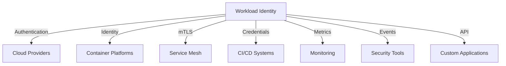

# Integration Guide

This document provides detailed instructions for integrating the workload identity system with various platforms, services, and tools.

## Table of Contents
1. [Integration Overview](#integration-overview)
2. [Cloud Provider Integration](#cloud-provider-integration)
3. [Container Platform Integration](#container-platform-integration)
4. [Service Mesh Integration](#service-mesh-integration)
5. [CI/CD Integration](#cicd-integration)
6. [Monitoring Integration](#monitoring-integration)
7. [Security Tool Integration](#security-tool-integration)
8. [API Integration](#api-integration)
9. [Custom Integration](#custom-integration)

## Integration Overview

### 1. Integration Architecture


### 2. Integration Methods
```yaml
# Example Integration Configuration
integration_methods:
  authentication:
    - oidc:
        provider: "workload-identity"
        client_id: "workload-identity-client"
        scopes: ["openid", "profile", "email"]
    - jwt:
        issuer: "workload-identity"
        audience: "workload-identity-api"
        lifetime: 3600
    - mtls:
        ca_cert: "/etc/workload-identity/ca.crt"
        client_cert: "/etc/workload-identity/client.crt"
        client_key: "/etc/workload-identity/client.key"
  authorization:
    - rbac:
        roles:
          - name: "admin"
            permissions: ["*"]
          - name: "user"
            permissions: ["read"]
    - abac:
        attributes:
          - "environment"
          - "location"
          - "time"
  monitoring:
    - metrics:
        port: 9090
        path: "/metrics"
    - logs:
        level: "info"
        format: "json"
    - traces:
        sampling_rate: 0.1
        exporter: "jaeger"
```

#### Implementation Details
- **Authentication Methods**:
  - OIDC: OpenID Connect for identity federation
  - JWT: JSON Web Tokens for API authentication
  - mTLS: Mutual TLS for service-to-service authentication

- **Authorization Methods**:
  - RBAC: Role-based access control
  - ABAC: Attribute-based access control

- **Monitoring Methods**:
  - Metrics: Prometheus metrics
  - Logs: Structured logging
  - Traces: Distributed tracing

## Cloud Provider Integration

### 1. AWS Integration
```yaml
# Example AWS Integration Configuration
aws_integration:
  iam:
    role_arn: "arn:aws:iam::123456789012:role/workload-identity"
    session_duration: 3600
    permissions:
      - "sts:AssumeRole"
      - "secretsmanager:GetSecretValue"
  eks:
    cluster_name: "workload-identity-cluster"
    namespace: "workload-identity"
    service_account:
      name: "workload-identity"
      annotations:
        eks.amazonaws.com/role-arn: "arn:aws:iam::123456789012:role/workload-identity"
  secrets:
    region: "us-west-2"
    encryption: "aws:kms"
    rotation:
      enabled: true
      interval: "30d"
```

#### Implementation Details
- **IAM Role Configuration**:
  ```yaml
  # Example IAM Role Configuration
  iam_role:
    trust_policy:
      Version: "2012-10-17"
      Statement:
        - Effect: "Allow"
          Principal:
            Service: "eks.amazonaws.com"
          Action: "sts:AssumeRole"
    permissions_policy:
      Version: "2012-10-17"
      Statement:
        - Effect: "Allow"
          Action:
            - "secretsmanager:GetSecretValue"
            - "kms:Decrypt"
          Resource: "*"
  ```

- **EKS Configuration**:
  ```yaml
  # Example EKS Configuration
  eks_configuration:
    cluster:
      name: "workload-identity-cluster"
      region: "us-west-2"
      version: "1.24"
    node_groups:
      - name: "workload-identity-nodes"
        instance_types: ["t3.medium"]
        min_size: 2
        max_size: 5
    addons:
      - name: "vpc-cni"
      - name: "coredns"
      - name: "kube-proxy"
  ```

### 2. GCP Integration
```yaml
# Example GCP Integration Configuration
gcp_integration:
  workload_identity:
    project_id: "workload-identity-project"
    pool_id: "workload-identity-pool"
    provider_id: "workload-identity-provider"
    service_account:
      email: "workload-identity@workload-identity-project.iam.gserviceaccount.com"
      roles:
        - "roles/secretmanager.secretAccessor"
        - "roles/cloudkms.cryptoKeyDecrypter"
  gke:
    cluster_name: "workload-identity-cluster"
    location: "us-central1"
    node_pools:
      - name: "workload-identity-nodes"
        machine_type: "e2-medium"
        min_nodes: 2
        max_nodes: 5
  secret_manager:
    project_id: "workload-identity-project"
    encryption: "customer-managed"
    rotation:
      enabled: true
      interval: "30d"
```

#### Implementation Details
- **Workload Identity Pool Configuration**:
  ```yaml
  # Example Workload Identity Pool Configuration
  workload_identity_pool:
    name: "workload-identity-pool"
    display_name: "Workload Identity Pool"
    description: "Pool for workload identity federation"
    providers:
      - name: "workload-identity-provider"
        display_name: "Workload Identity Provider"
        attribute_mapping:
          google.subject: "assertion.sub"
          attribute.environment: "assertion.environment"
    service_accounts:
      - email: "workload-identity@workload-identity-project.iam.gserviceaccount.com"
        roles:
          - "roles/secretmanager.secretAccessor"
          - "roles/cloudkms.cryptoKeyDecrypter"
  ```

- **GKE Configuration**:
  ```yaml
  # Example GKE Configuration
  gke_configuration:
    cluster:
      name: "workload-identity-cluster"
      location: "us-central1"
      version: "1.24"
      network: "default"
      subnetwork: "default"
    node_pools:
      - name: "workload-identity-nodes"
        machine_type: "e2-medium"
        min_nodes: 2
        max_nodes: 5
        service_account: "workload-identity@workload-identity-project.iam.gserviceaccount.com"
    addons:
      - name: "HttpLoadBalancing"
      - name: "HorizontalPodAutoscaling"
      - name: "NetworkPolicy"
  ```

### 3. Azure Integration
```yaml
# Example Azure Integration Configuration
azure_integration:
  managed_identity:
    subscription_id: "subscription-id"
    resource_group: "workload-identity-rg"
    identity_name: "workload-identity"
    roles:
      - "Key Vault Secrets User"
      - "Key Vault Crypto User"
  aks:
    cluster_name: "workload-identity-cluster"
    resource_group: "workload-identity-rg"
    node_pools:
      - name: "workload-identity-nodes"
        vm_size: "Standard_D2s_v3"
        min_count: 2
        max_count: 5
  key_vault:
    vault_name: "workload-identity-vault"
    access_policy: true
    secrets:
      rotation:
        enabled: true
        interval: "30d"
```

#### Implementation Details
- **Managed Identity Configuration**:
  ```yaml
  # Example Managed Identity Configuration
  managed_identity:
    name: "workload-identity"
    type: "SystemAssigned"
    roles:
      - name: "Key Vault Secrets User"
        scope: "/subscriptions/subscription-id/resourceGroups/workload-identity-rg"
      - name: "Key Vault Crypto User"
        scope: "/subscriptions/subscription-id/resourceGroups/workload-identity-rg"
    access_policies:
      - object_id: "object-id"
        permissions:
          secrets:
            - "get"
            - "list"
          keys:
            - "get"
            - "list"
  ```

- **AKS Configuration**:
  ```yaml
  # Example AKS Configuration
  aks_configuration:
    cluster:
      name: "workload-identity-cluster"
      location: "eastus"
      version: "1.24"
      network_plugin: "azure"
      network_policy: "azure"
    node_pools:
      - name: "workload-identity-nodes"
        vm_size: "Standard_D2s_v3"
        min_count: 2
        max_count: 5
        enable_auto_scaling: true
        os_disk_size_gb: 128
    addons:
      - name: "monitoring"
      - name: "azure-policy"
      - name: "ingress-application-gateway"
  ```

## Container Platform Integration

### 1. Kubernetes Integration
```yaml
# Example Kubernetes Integration Configuration
kubernetes_integration:
  service_account:
    name: "workload-identity"
    namespace: "workload-identity"
    annotations:
      eks.amazonaws.com/role-arn: "arn:aws:iam::123456789012:role/workload-identity"
      azure.workload.identity/client-id: "client-id"
      iam.gke.io/gcp-service-account: "workload-identity@workload-identity-project.iam.gserviceaccount.com"
  webhook:
    enabled: true
    path: "/mutate"
    failure_policy: "Ignore"
    namespace_selector:
      matchLabels:
        workload-identity: "enabled"
  rbac:
    cluster_role: "workload-identity-role"
    cluster_role_binding: "workload-identity-binding"
    rules:
      - apiGroups: [""]
        resources: ["secrets"]
        verbs: ["get", "list"]
      - apiGroups: ["workload-identity.io"]
        resources: ["identities"]
        verbs: ["get", "list", "watch"]
```

#### Implementation Details
- **Service Account Configuration**:
  ```yaml
  # Example Service Account Configuration
  service_account:
    apiVersion: "v1"
    kind: "ServiceAccount"
    metadata:
      name: "workload-identity"
      namespace: "workload-identity"
      annotations:
        eks.amazonaws.com/role-arn: "arn:aws:iam::123456789012:role/workload-identity"
        azure.workload.identity/client-id: "client-id"
        iam.gke.io/gcp-service-account: "workload-identity@workload-identity-project.iam.gserviceaccount.com"
  ```

- **Webhook Configuration**:
  ```yaml
  # Example Webhook Configuration
  webhook:
    apiVersion: "admissionregistration.k8s.io/v1"
    kind: "MutatingWebhookConfiguration"
    metadata:
      name: "workload-identity-webhook"
    webhooks:
      - name: "workload-identity.webhook.io"
        clientConfig:
          service:
            name: "workload-identity-webhook"
            namespace: "workload-identity"
            path: "/mutate"
        rules:
          - apiGroups: [""]
            apiVersions: ["v1"]
            resources: ["pods"]
        failurePolicy: "Ignore"
        namespaceSelector:
          matchLabels:
            workload-identity: "enabled"
  ```

### 2. OpenShift Integration
```yaml
# Example OpenShift Integration Configuration
openshift_integration:
  service_account:
    name: "workload-identity"
    namespace: "workload-identity"
    annotations:
      serviceaccounts.openshift.io/oauth-redirectreference: "workload-identity"
  scc:
    name: "workload-identity-scc"
    priority: 10
    run_as_user:
      type: "MustRunAsRange"
      uid_range_min: 1000
      uid_range_max: 2000
    se_linux_context:
      type: "MustRunAs"
      user: "system_u"
      role: "system_r"
      type: "system_t"
  route:
    hostname: "workload-identity.example.com"
    tls:
      termination: "edge"
      certificate: "/etc/workload-identity/tls.crt"
      key: "/etc/workload-identity/tls.key"
```

#### Implementation Details
- **Security Context Constraints**:
  ```yaml
  # Example SCC Configuration
  scc:
    apiVersion: "security.openshift.io/v1"
    kind: "SecurityContextConstraints"
    metadata:
      name: "workload-identity-scc"
    priority: 10
    allowPrivilegedContainer: false
    runAsUser:
      type: "MustRunAsRange"
      uidRangeMin: 1000
      uidRangeMax: 2000
    seLinuxContext:
      type: "MustRunAs"
      user: "system_u"
      role: "system_r"
      type: "system_t"
    volumes:
      - "configMap"
      - "secret"
      - "emptyDir"
  ```

- **Route Configuration**:
  ```yaml
  # Example Route Configuration
  route:
    apiVersion: "route.openshift.io/v1"
    kind: "Route"
    metadata:
      name: "workload-identity"
      namespace: "workload-identity"
    spec:
      host: "workload-identity.example.com"
      to:
        kind: "Service"
        name: "workload-identity"
      tls:
        termination: "edge"
        certificate: "/etc/workload-identity/tls.crt"
        key: "/etc/workload-identity/tls.key"
  ```

## Service Mesh Integration

### 1. Istio Integration
```yaml
# Example Istio Integration Configuration
istio_integration:
  mtls:
    mode: "STRICT"
    certificate_rotation: "24h"
    trust_domain: "workload-identity"
  authorization:
    policy:
      name: "workload-identity-policy"
      namespace: "workload-identity"
      rules:
        - from:
            source:
              principals: ["cluster.local/ns/workload-identity/sa/workload-identity"]
          to:
            operation:
              methods: ["GET", "POST"]
              paths: ["/api/*"]
  traffic:
    encryption: true
    routing:
      enabled: true
      rules:
        - match:
            - uri:
                prefix: "/api"
          route:
            - destination:
                host: "workload-identity"
                port:
                  number: 8080
```

#### Implementation Details
- **mTLS Configuration**:
  ```yaml
  # Example mTLS Configuration
  mtls:
    apiVersion: "security.istio.io/v1beta1"
    kind: "PeerAuthentication"
    metadata:
      name: "workload-identity-mtls"
      namespace: "workload-identity"
    spec:
      mtls:
        mode: "STRICT"
      selector:
        matchLabels:
          app: "workload-identity"
  ```

- **Authorization Policy**:
  ```yaml
  # Example Authorization Policy
  authorization_policy:
    apiVersion: "security.istio.io/v1beta1"
    kind: "AuthorizationPolicy"
    metadata:
      name: "workload-identity-policy"
      namespace: "workload-identity"
    spec:
      selector:
        matchLabels:
          app: "workload-identity"
      rules:
        - from:
            - source:
                principals: ["cluster.local/ns/workload-identity/sa/workload-identity"]
          to:
            - operation:
                methods: ["GET", "POST"]
                paths: ["/api/*"]
  ```

### 2. Linkerd Integration
```yaml
# Example Linkerd Integration Configuration
linkerd_integration:
  mtls:
    enabled: true
    trust_anchors: "workload-identity-ca"
    issuer:
      name: "workload-identity-issuer"
      namespace: "workload-identity"
  authorization:
    policy:
      name: "workload-identity-policy"
      namespace: "workload-identity"
      rules:
        - principal: "workload-identity"
          resources:
            - "workload-identity:*"
          actions:
            - "get"
            - "list"
  monitoring:
    metrics: true
    tracing: true
    prometheus:
      enabled: true
      port: 9090
```

#### Implementation Details
- **mTLS Configuration**:
  ```yaml
  # Example mTLS Configuration
  mtls:
    apiVersion: "policy.linkerd.io/v1alpha1"
    kind: "Server"
    metadata:
      name: "workload-identity-server"
      namespace: "workload-identity"
    spec:
      podSelector:
        matchLabels:
          app: "workload-identity"
      port: 8080
      proxyProtocol: "HTTP/1"
  ```

- **Authorization Policy**:
  ```yaml
  # Example Authorization Policy
  authorization_policy:
    apiVersion: "policy.linkerd.io/v1alpha1"
    kind: "AuthorizationPolicy"
    metadata:
      name: "workload-identity-policy"
      namespace: "workload-identity"
    spec:
      targetRef:
        kind: "Server"
        name: "workload-identity-server"
      requiredAuthenticationRefs:
        - kind: "MeshTLSAuthentication"
          name: "workload-identity-mtls"
  ```

## CI/CD Integration

### 1. GitHub Actions Integration
```yaml
# Example GitHub Actions Integration Configuration
github_actions_integration:
  workflow:
    name: "Workload Identity"
    on:
      push:
        branches: [ main ]
      pull_request:
        branches: [ main ]
  permissions:
    id-token: write
    contents: read
  environment:
    name: "production"
    url: "https://workload-identity.example.com"
  jobs:
    build:
      runs-on: "ubuntu-latest"
      steps:
        - uses: "actions/checkout@v3"
        - name: "Configure Workload Identity"
          uses: "azure/login@v1"
          with:
            client-id: ${{ secrets.AZURE_CLIENT_ID }}
            tenant-id: ${{ secrets.AZURE_TENANT_ID }}
            subscription-id: ${{ secrets.AZURE_SUBSCRIPTION_ID }}
```

#### Implementation Details
- **Workflow Configuration**:
  ```yaml
  # Example Workflow Configuration
  workflow:
    name: "Workload Identity"
    on:
      push:
        branches: [ main ]
      pull_request:
        branches: [ main ]
    permissions:
      id-token: write
      contents: read
    jobs:
      build:
        runs-on: "ubuntu-latest"
        steps:
          - uses: "actions/checkout@v3"
          - name: "Configure Workload Identity"
            uses: "azure/login@v1"
            with:
              client-id: ${{ secrets.AZURE_CLIENT_ID }}
              tenant-id: ${{ secrets.AZURE_TENANT_ID }}
              subscription-id: ${{ secrets.AZURE_SUBSCRIPTION_ID }}
          - name: "Build and Deploy"
            run: |
              echo "Building and deploying with workload identity..."
  ```

### 2. GitLab CI Integration
```yaml
# Example GitLab CI Integration Configuration
gitlab_ci_integration:
  workflow:
    stages:
      - build
      - test
      - deploy
  variables:
    WORKLOAD_IDENTITY_URL: "https://workload-identity.example.com"
    WORKLOAD_IDENTITY_TOKEN: $CI_JOB_JWT
  environment:
    name: "production"
    url: "https://workload-identity.example.com"
  jobs:
    build:
      stage: build
      script:
        - echo "Building with workload identity..."
        - curl -H "Authorization: Bearer $WORKLOAD_IDENTITY_TOKEN" $WORKLOAD_IDENTITY_URL/api/build
```

#### Implementation Details
- **Pipeline Configuration**:
  ```yaml
  # Example Pipeline Configuration
  pipeline:
    stages:
      - build
      - test
      - deploy
    variables:
      WORKLOAD_IDENTITY_URL: "https://workload-identity.example.com"
      WORKLOAD_IDENTITY_TOKEN: $CI_JOB_JWT
    jobs:
      build:
        stage: build
        script:
          - echo "Building with workload identity..."
          - curl -H "Authorization: Bearer $WORKLOAD_IDENTITY_TOKEN" $WORKLOAD_IDENTITY_URL/api/build
      test:
        stage: test
        script:
          - echo "Testing with workload identity..."
          - curl -H "Authorization: Bearer $WORKLOAD_IDENTITY_TOKEN" $WORKLOAD_IDENTITY_URL/api/test
      deploy:
        stage: deploy
        script:
          - echo "Deploying with workload identity..."
          - curl -H "Authorization: Bearer $WORKLOAD_IDENTITY_TOKEN" $WORKLOAD_IDENTITY_URL/api/deploy
  ```

## Monitoring Integration

### 1. Prometheus Integration
```yaml
# Example Prometheus Integration Configuration
prometheus_integration:
  metrics:
    port: 9090
    path: "/metrics"
    interval: "15s"
  service_monitor:
    name: "workload-identity"
    namespace: "monitoring"
    endpoints:
      - port: "metrics"
        interval: "15s"
        path: "/metrics"
  rules:
    - name: "workload-identity"
      namespace: "monitoring"
      groups:
        - name: "workload-identity"
          rules:
            - alert: "HighErrorRate"
              expr: "rate(workload_identity_errors_total[5m]) > 0.1"
              for: "5m"
              labels:
                severity: "critical"
              annotations:
                summary: "High error rate detected"
                description: "Error rate is above 10% for the last 5 minutes"
```

#### Implementation Details
- **Service Monitor Configuration**:
  ```yaml
  # Example Service Monitor Configuration
  service_monitor:
    apiVersion: "monitoring.coreos.com/v1"
    kind: "ServiceMonitor"
    metadata:
      name: "workload-identity"
      namespace: "monitoring"
    spec:
      selector:
        matchLabels:
          app: "workload-identity"
      endpoints:
        - port: "metrics"
          interval: "15s"
          path: "/metrics"
      namespaceSelector:
        matchNames:
          - "workload-identity"
  ```

- **Prometheus Rules**:
  ```yaml
  # Example Prometheus Rules
  prometheus_rules:
    apiVersion: "monitoring.coreos.com/v1"
    kind: "PrometheusRule"
    metadata:
      name: "workload-identity"
      namespace: "monitoring"
    spec:
      groups:
        - name: "workload-identity"
          rules:
            - alert: "HighErrorRate"
              expr: "rate(workload_identity_errors_total[5m]) > 0.1"
              for: "5m"
              labels:
                severity: "critical"
              annotations:
                summary: "High error rate detected"
                description: "Error rate is above 10% for the last 5 minutes"
  ```

### 2. Grafana Integration
```yaml
# Example Grafana Integration Configuration
grafana_integration:
  dashboard:
    name: "Workload Identity"
    uid: "workload-identity"
    panels:
      - title: "Authentication Rate"
        type: "graph"
        targets:
          - expr: "rate(workload_identity_auth_attempts_total[5m])"
      - title: "Error Rate"
        type: "graph"
        targets:
          - expr: "rate(workload_identity_errors_total[5m])"
  datasource:
    name: "Prometheus"
    type: "prometheus"
    url: "http://prometheus:9090"
  alerts:
    enabled: true
    notification_channels:
      - type: "email"
        settings:
          addresses: "alerts@example.com"
      - type: "slack"
        settings:
          url: "https://hooks.slack.com/services/xxx/yyy/zzz"
```

#### Implementation Details
- **Dashboard Configuration**:
  ```yaml
  # Example Dashboard Configuration
  dashboard:
    apiVersion: "integreatly.org/v1alpha1"
    kind: "GrafanaDashboard"
    metadata:
      name: "workload-identity"
      namespace: "monitoring"
    spec:
      json: |
        {
          "dashboard": {
            "id": null,
            "title": "Workload Identity",
            "tags": ["workload-identity"],
            "timezone": "browser",
            "panels": [
              {
                "title": "Authentication Rate",
                "type": "graph",
                "datasource": "Prometheus",
                "targets": [
                  {
                    "expr": "rate(workload_identity_auth_attempts_total[5m])",
                    "legendFormat": "{{method}}"
                  }
                ]
              }
            ]
          }
        }
  ```

- **Alert Configuration**:
  ```yaml
  # Example Alert Configuration
  alert:
    apiVersion: "integreatly.org/v1alpha1"
    kind: "GrafanaAlert"
    metadata:
      name: "workload-identity"
      namespace: "monitoring"
    spec:
      name: "High Error Rate"
      message: "Error rate is above 10% for the last 5 minutes"
      frequency: "1m"
      conditions:
        - evaluator:
            type: "gt"
            params: [0.1]
          operator:
            type: "and"
          query:
            params: ["A", "5m", "now"]
          reducer:
            type: "avg"
            params: []
          type: "query"
  ```

## Security Tool Integration

### 1. Vault Integration
```yaml
# Example Vault Integration Configuration
vault_integration:
  auth:
    method: "kubernetes"
    role: "workload-identity"
    path: "kubernetes"
    config:
      token_reviewer_jwt: "/var/run/secrets/kubernetes.io/serviceaccount/token"
      kubernetes_host: "https://kubernetes.default.svc"
      kubernetes_ca_cert: "/var/run/secrets/kubernetes.io/serviceaccount/ca.crt"
  secrets:
    engine: "kv-v2"
    path: "workload-identity"
    policies:
      - name: "workload-identity-policy"
        rules: |
          path "workload-identity/*" {
            capabilities = ["read"]
          }
```

#### Implementation Details
- **Authentication Configuration**:
  ```yaml
  # Example Authentication Configuration
  auth:
    apiVersion: "vault.hashicorp.com/v1"
    kind: "VaultAuth"
    metadata:
      name: "workload-identity"
      namespace: "workload-identity"
    spec:
      type: "kubernetes"
      params:
        role: "workload-identity"
        path: "kubernetes"
      config:
        token_reviewer_jwt: "/var/run/secrets/kubernetes.io/serviceaccount/token"
        kubernetes_host: "https://kubernetes.default.svc"
        kubernetes_ca_cert: "/var/run/secrets/kubernetes.io/serviceaccount/ca.crt"
  ```

- **Secret Engine Configuration**:
  ```yaml
  # Example Secret Engine Configuration
  secret_engine:
    apiVersion: "vault.hashicorp.com/v1"
    kind: "VaultSecretEngine"
    metadata:
      name: "workload-identity"
      namespace: "workload-identity"
    spec:
      type: "kv-v2"
      path: "workload-identity"
      options:
        version: 2
  ```

### 2. Keycloak Integration
```yaml
# Example Keycloak Integration Configuration
keycloak_integration:
  realm:
    name: "workload-identity"
    enabled: true
    ssl_required: "external"
  client:
    client_id: "workload-identity"
    secret: "workload-identity-secret"
    redirect_uris:
      - "https://workload-identity.example.com/*"
    web_origins:
      - "https://workload-identity.example.com"
  roles:
    - name: "admin"
      description: "Administrator role"
    - name: "user"
      description: "User role"
```

#### Implementation Details
- **Realm Configuration**:
  ```yaml
  # Example Realm Configuration
  realm:
    apiVersion: "keycloak.org/v1alpha1"
    kind: "KeycloakRealm"
    metadata:
      name: "workload-identity"
      namespace: "workload-identity"
    spec:
      realm:
        realm: "workload-identity"
        enabled: true
        sslRequired: "external"
        roles:
          realm:
            - name: "admin"
              description: "Administrator role"
            - name: "user"
              description: "User role"
  ```

- **Client Configuration**:
  ```yaml
  # Example Client Configuration
  client:
    apiVersion: "keycloak.org/v1alpha1"
    kind: "KeycloakClient"
    metadata:
      name: "workload-identity"
      namespace: "workload-identity"
    spec:
      realmSelector:
        matchLabels:
          app: "keycloak"
      client:
        clientId: "workload-identity"
        secret: "workload-identity-secret"
        redirectUris:
          - "https://workload-identity.example.com/*"
        webOrigins:
          - "https://workload-identity.example.com"
        standardFlowEnabled: true
        implicitFlowEnabled: false
        directAccessGrantsEnabled: true
        serviceAccountsEnabled: true
  ```

## API Integration

### 1. REST API
```yaml
# Example REST API Integration Configuration
rest_api_integration:
  endpoints:
    - path: "/api/v1/identities"
      method: "GET"
      authentication:
        type: "jwt"
        required: true
      authorization:
        roles:
          - "admin"
          - "user"
    - path: "/api/v1/certificates"
      method: "POST"
      authentication:
        type: "mtls"
        required: true
      authorization:
        roles:
          - "admin"
  rate_limiting:
    enabled: true
    requests_per_second: 100
  documentation:
    enabled: true
    path: "/api/docs"
```

#### Implementation Details
- **API Endpoint Configuration**:
  ```yaml
  # Example API Endpoint Configuration
  api_endpoints:
    - path: "/api/v1/identities"
      method: "GET"
      handler: "GetIdentities"
      middleware:
        - "authentication"
        - "authorization"
        - "rate_limiting"
      response:
        content_type: "application/json"
        schema:
          type: "array"
          items:
            type: "object"
            properties:
              id:
                type: "string"
              name:
                type: "string"
              roles:
                type: "array"
                items:
                  type: "string"
  ```

- **Rate Limiting Configuration**:
  ```yaml
  # Example Rate Limiting Configuration
  rate_limiting:
    enabled: true
    strategy: "token_bucket"
    rate: 100
    burst: 200
    storage:
      type: "redis"
      address: "redis:6379"
    headers:
      enabled: true
      limit: "X-RateLimit-Limit"
      remaining: "X-RateLimit-Remaining"
      reset: "X-RateLimit-Reset"
  ```

### 2. gRPC API
```yaml
# Example gRPC API Integration Configuration
grpc_api_integration:
  services:
    - name: "IdentityService"
      methods:
        - name: "GetIdentity"
          input: "GetIdentityRequest"
          output: "GetIdentityResponse"
          authentication:
            type: "jwt"
            required: true
          authorization:
            roles:
              - "admin"
              - "user"
        - name: "CreateCertificate"
          input: "CreateCertificateRequest"
          output: "CreateCertificateResponse"
          authentication:
            type: "mtls"
            required: true
          authorization:
            roles:
              - "admin"
  interceptors:
    - name: "authentication"
      type: "jwt"
    - name: "authorization"
      type: "rbac"
    - name: "logging"
      type: "structured"
```

#### Implementation Details
- **Service Configuration**:
  ```yaml
  # Example Service Configuration
  grpc_service:
    name: "IdentityService"
    package: "workload.identity.v1"
    methods:
      - name: "GetIdentity"
        input: "GetIdentityRequest"
        output: "GetIdentityResponse"
        options:
          authentication:
            type: "jwt"
            required: true
          authorization:
            roles:
              - "admin"
              - "user"
        implementation:
          handler: "GetIdentity"
          middleware:
            - "authentication"
            - "authorization"
            - "logging"
  ```

- **Interceptor Configuration**:
  ```yaml
  # Example Interceptor Configuration
  interceptors:
    - name: "authentication"
      type: "jwt"
      config:
        issuer: "workload-identity"
        audience: "workload-identity-api"
        verification:
          jwks_url: "https://workload-identity.example.com/.well-known/jwks.json"
          algorithms:
            - "RS256"
    - name: "authorization"
      type: "rbac"
      config:
        roles:
          - name: "admin"
            permissions: ["*"]
          - name: "user"
            permissions: ["read"]
  ```

## Custom Integration

### 1. Custom Authentication
```yaml
# Example Custom Authentication Configuration
custom_authentication:
  provider:
    name: "custom-auth"
    type: "plugin"
    config:
      plugin_path: "/plugins/custom-auth.so"
      config_file: "/etc/workload-identity/custom-auth.yaml"
  validation:
    enabled: true
    timeout: "5s"
    cache:
      enabled: true
      ttl: "5m"
  logging:
    level: "info"
    format: "json"
```

#### Implementation Details
- **Provider Configuration**:
  ```yaml
  # Example Provider Configuration
  auth_provider:
    name: "custom-auth"
    type: "plugin"
    config:
      plugin_path: "/plugins/custom-auth.so"
      config_file: "/etc/workload-identity/custom-auth.yaml"
      options:
        timeout: "5s"
        retries: 3
        backoff:
          initial: "100ms"
          max: "1s"
          factor: 2
  ```

- **Validation Configuration**:
  ```yaml
  # Example Validation Configuration
  validation:
    enabled: true
    timeout: "5s"
    cache:
      enabled: true
      ttl: "5m"
      size: "1000"
    rules:
      - name: "token_format"
        type: "regex"
        pattern: "^[A-Za-z0-9-_=]+\\.[A-Za-z0-9-_=]+\\.?[A-Za-z0-9-_.+/=]*$"
      - name: "token_expiration"
        type: "timestamp"
        max_age: "1h"
  ```

### 2. Custom Authorization
```yaml
# Example Custom Authorization Configuration
custom_authorization:
  provider:
    name: "custom-authz"
    type: "plugin"
    config:
      plugin_path: "/plugins/custom-authz.so"
      config_file: "/etc/workload-identity/custom-authz.yaml"
  policy:
    engine: "rego"
    rules:
      - name: "allow_admin"
        rule: |
          package workload.identity.authz
          default allow = false
          allow {
            input.identity.roles[_] = "admin"
          }
  evaluation:
    enabled: true
    timeout: "100ms"
    cache:
      enabled: true
      ttl: "5m"
```

#### Implementation Details
- **Provider Configuration**:
  ```yaml
  # Example Provider Configuration
  authz_provider:
    name: "custom-authz"
    type: "plugin"
    config:
      plugin_path: "/plugins/custom-authz.so"
      config_file: "/etc/workload-identity/custom-authz.yaml"
      options:
        timeout: "100ms"
        max_complexity: 1000
        cache:
          enabled: true
          ttl: "5m"
          size: "1000"
  ```

- **Policy Configuration**:
  ```yaml
  # Example Policy Configuration
  policy:
    engine: "rego"
    rules:
      - name: "allow_admin"
        rule: |
          package workload.identity.authz
          default allow = false
          allow {
            input.identity.roles[_] = "admin"
          }
      - name: "allow_user"
        rule: |
          package workload.identity.authz
          default allow = false
          allow {
            input.identity.roles[_] = "user"
            input.action = "read"
          }
  ```

## Conclusion

This guide provides comprehensive integration instructions for the workload identity system. Remember to:
- Follow security best practices
- Implement proper error handling
- Monitor integration health
- Test thoroughly
- Document changes

For additional information, refer to:
- [Architecture Guide](architecture_guide.md)
- [Security Best Practices](security_best_practices.md)
- [Deployment Guide](deployment_guide.md) 