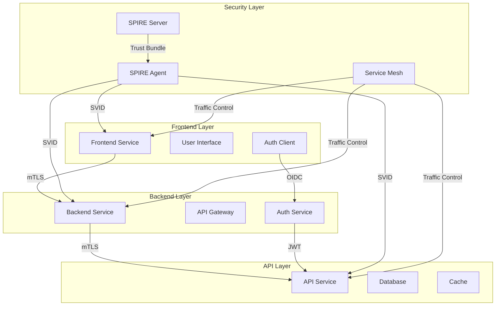
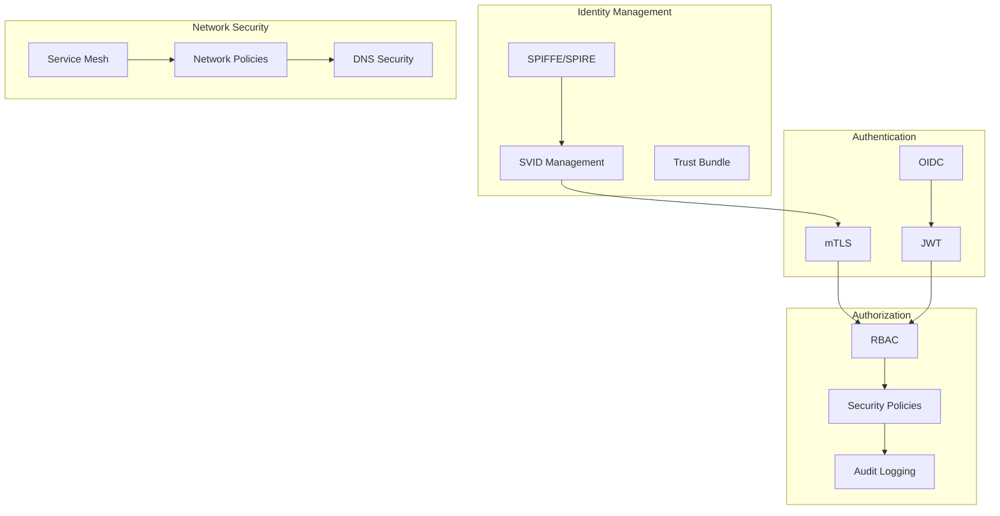
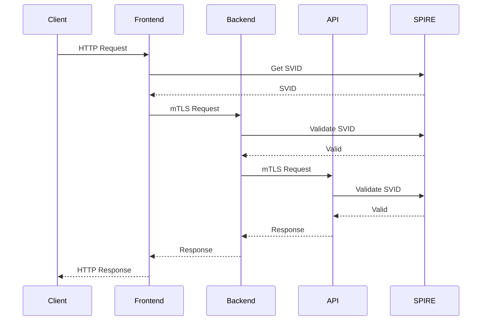

# SPIFFE Workload Identity mTLS Demo

## Overview
This repository demonstrates a secure microservices architecture using SPIFFE/SPIRE for workload identity and mutual TLS (mTLS) authentication. The demo includes a frontend, backend, and API service that communicate securely using mTLS, with automatic certificate rotation and renewal.

## Architecture

### System Architecture


### Security Architecture


### Service Communication Flow


### Components
- **Frontend Service**: Web application that communicates with the backend
  - User interface and client-side logic
  - Secure communication with backend
  - SPIFFE ID: spiffe://example.org/frontend
- **Backend Service**: API service that processes requests from the frontend
  - Business logic and data processing
  - Secure communication with API service
  - SPIFFE ID: spiffe://example.org/backend
- **API Service**: Core service that handles data operations
  - Data management and persistence
  - Secure communication with external services
  - SPIFFE ID: spiffe://example.org/api
- **SPIFFE/SPIRE**: Provides workload identity and automatic certificate management
  - SPIRE Server: Central authority for workload identity
  - SPIRE Agent: Node-level workload attestation
  - Automatic SVID rotation and renewal

### Security Features
- **Workload Identity**: Each service has a unique SPIFFE ID
  - Automatic identity assignment
  - Identity verification
  - Secure identity rotation
- **Certificate Management**:
  - Automatic certificate rotation (80% lifetime threshold)
  - Memory-backed storage for sensitive data
  - Configurable renewal intervals
  - Trust bundle refresh mechanism
- **Security Context**:
  - Non-root user execution
  - Dropped Linux capabilities
  - Read-only filesystem
  - Runtime default seccomp profile
  - No privilege escalation
- **Network Security**:
  - mTLS for all service-to-service communication
  - Network policies for pod-to-pod communication
  - DNS access control
  - Service mesh integration

### Monitoring and Observability
- **Metrics**:
  - Certificate expiration and rotation
  - TLS handshake success/failure
  - Request latency and errors
  - Resource utilization
  - Service mesh metrics
- **Health Checks**:
  - Service health endpoints
  - Certificate validity checks
  - SPIFFE helper status
  - Service mesh health
- **Logging**:
  - Structured JSON logging
  - Certificate rotation events
  - Security audit logs
  - Service mesh logs

## Configuration

### SPIFFE Helper Configuration
Each service has its own SPIFFE helper configuration:

```yaml
# Service-specific ConfigMap
apiVersion: v1
kind: ConfigMap
metadata:
  name: spiffe-helper-config-{service}
data:
  helper.conf: |
    # Certificate settings
    renewal_interval = "30s"
    rotation_threshold = "80%"
    min_rotation_interval = "5m"
    
    # Error handling
    retry_interval = "5s"
    max_retries = 3
    
    # Trust bundle
    refresh_interval = "1h"
    
    # Service mesh integration
    service_mesh = "istio"
    service_mesh_port = "15001"
```

### Environment Variables
```yaml
env:
- name: SPIFFE_ENDPOINT_SOCKET
  value: "/run/spiffe/workload/workload_api.sock"
- name: SPIFFE_TRUST_DOMAIN
  value: "example.org"
- name: SERVICE_MESH_MODE
  value: "istio"
```

### Volume Configuration
```yaml
volumes:
- name: spiffe-workload-api
  emptyDir:
    medium: Memory  # Memory-backed storage
- name: spiffe-certs
  emptyDir:
    medium: Memory  # Memory-backed storage
- name: service-mesh-certs
  emptyDir:
    medium: Memory  # Memory-backed storage
```

## Security Considerations

### Certificate Management
- Certificates are stored in memory-backed volumes
- Automatic rotation at 80% of certificate lifetime
- Configurable renewal intervals
- Trust bundle refresh mechanism
- Service mesh certificate integration

### Container Security
- Non-root user execution
- Dropped Linux capabilities
- Read-only filesystem
- Runtime default seccomp profile
- No privilege escalation
- Resource limits and requests

### Network Security
- mTLS for all service-to-service communication
- Network policies restricting pod-to-pod communication
- DNS access control
- Service mesh security policies
- Egress traffic control

## Monitoring

### Metrics
- Certificate expiration time
- Certificate rotation events
- TLS handshake success/failure
- Request latency and errors
- Resource utilization
- Service mesh metrics
- Security events

### Health Checks
- Service health endpoints
- Certificate validity checks
- SPIFFE helper status
- Service mesh health
- Security policy compliance

### Logging
- Structured JSON logging
- Certificate rotation events
- Security audit logs
- Service mesh logs
- Access logs

## Troubleshooting

### Common Issues
1. **Certificate Rotation Failures**
   - Check SPIFFE helper logs
   - Verify trust domain configuration
   - Check network connectivity to SPIRE server
   - Verify service mesh configuration

2. **TLS Handshake Failures**
   - Verify certificate validity
   - Check trust bundle configuration
   - Verify service identity
   - Check service mesh policies

3. **SPIFFE Helper Issues**
   - Check helper configuration
   - Verify volume mounts
   - Check security context
   - Verify service mesh integration

### Debugging Commands
```bash
# Check certificate status
kubectl exec -n demo <pod-name> -c spiffe-helper -- spiffe-helper status

# View certificate details
kubectl exec -n demo <pod-name> -c spiffe-helper -- cat /tmp/<service>.crt

# Check SPIFFE helper logs
kubectl logs -n demo <pod-name> -c spiffe-helper

# Verify service identity
kubectl exec -n demo <pod-name> -c spiffe-helper -- spiffe-helper verify

# Check service mesh status
istioctl proxy-status
istioctl proxy-config all <pod-name>

# Verify network policies
kubectl get networkpolicy -n demo
kubectl describe networkpolicy -n demo
```

## Getting Started

1. **Prerequisites**
   - Kubernetes cluster (v1.20+)
   - SPIRE server and agent
   - Istio service mesh
   - kubectl configured

2. **Deployment**
   ```bash
   # Create namespace
   kubectl create namespace demo

   # Apply security policies
   ./infrastructure/kubernetes/security/apply-security-policies.sh

   # Deploy workloads
   ./infrastructure/kubernetes/workloads/deploy.sh

   # Verify deployment
   kubectl get pods -n demo
   kubectl get clusterspiffeid -n demo
   ```

3. **Verification**
   ```bash
   # Check pod status
   kubectl get pods -n demo

   # Verify certificates
   kubectl exec -n demo <pod-name> -c spiffe-helper -- spiffe-helper verify

   # Test service communication
   kubectl exec -n demo <frontend-pod> -- curl -k https://backend:8443/hello

   # Check service mesh
   istioctl proxy-status
   ```

## Contributing
Please read [CONTRIBUTING.md](CONTRIBUTING.md) for details on our code of conduct and the process for submitting pull requests.

## License
This project is licensed under the Apache License 2.0 - see the [LICENSE](../LICENSE) file for details.

## Implementation Details

### Frontend Service
```yaml
# Frontend deployment configuration
apiVersion: apps/v1
kind: Deployment
metadata:
  name: frontend
spec:
  template:
    spec:
      containers:
      - name: frontend
        image: frontend:latest
        ports:
        - containerPort: 8080
        env:
        - name: BACKEND_URL
          value: https://backend:8443
        - name: SPIFFE_ENDPOINT_SOCKET
          value: /run/spiffe/workload/workload_api.sock
        volumeMounts:
        - name: spiffe-workload-api
          mountPath: /run/spiffe/workload
        securityContext:
          runAsNonRoot: true
          readOnlyRootFilesystem: true
```

### Backend Service
```yaml
# Backend deployment configuration
apiVersion: apps/v1
kind: Deployment
metadata:
  name: backend
spec:
  template:
    spec:
      containers:
      - name: backend
        image: backend:latest
        ports:
        - containerPort: 8443
        env:
        - name: API_URL
          value: https://api:8443
        - name: SPIFFE_ENDPOINT_SOCKET
          value: /run/spiffe/workload/workload_api.sock
        volumeMounts:
        - name: spiffe-workload-api
          mountPath: /run/spiffe/workload
        securityContext:
          runAsNonRoot: true
          readOnlyRootFilesystem: true
```

### API Service
```yaml
# API service configuration
apiVersion: apps/v1
kind: Deployment
metadata:
  name: api
spec:
  template:
    spec:
      containers:
      - name: api
        image: api:latest
        ports:
        - containerPort: 8443
        env:
        - name: DB_URL
          valueFrom:
            secretKeyRef:
              name: db-credentials
              key: url
        - name: SPIFFE_ENDPOINT_SOCKET
          value: /run/spiffe/workload/workload_api.sock
        volumeMounts:
        - name: spiffe-workload-api
          mountPath: /run/spiffe/workload
        securityContext:
          runAsNonRoot: true
          readOnlyRootFilesystem: true
```

## Security Configuration

### Network Policies
```yaml
# Network policy for frontend
apiVersion: networking.k8s.io/v1
kind: NetworkPolicy
metadata:
  name: frontend-policy
spec:
  podSelector:
    matchLabels:
      app: frontend
  policyTypes:
  - Ingress
  - Egress
  ingress:
  - from:
    - namespaceSelector:
        matchLabels:
          name: ingress-nginx
    ports:
    - protocol: TCP
      port: 8080
  egress:
  - to:
    - podSelector:
        matchLabels:
          app: backend
    ports:
    - protocol: TCP
      port: 8443
```

### Service Mesh Configuration
```yaml
# Istio VirtualService for frontend
apiVersion: networking.istio.io/v1alpha3
kind: VirtualService
metadata:
  name: frontend-vs
spec:
  hosts:
  - frontend
  http:
  - match:
    - uri:
        prefix: /api
    route:
    - destination:
        host: backend
        port:
          number: 8443
    retries:
      attempts: 3
      perTryTimeout: 2s
```

### Monitoring Configuration
```yaml
# Prometheus ServiceMonitor
apiVersion: monitoring.coreos.com/v1
kind: ServiceMonitor
metadata:
  name: service-monitor
spec:
  selector:
    matchLabels:
      app: service
  endpoints:
  - port: metrics
    interval: 15s
    path: /metrics
```

## Performance Tuning

### Resource Configuration
```yaml
# Resource configuration for services
resources:
  requests:
    cpu: 100m
    memory: 128Mi
  limits:
    cpu: 500m
    memory: 512Mi
```

### Scaling Configuration
```yaml
# HorizontalPodAutoscaler configuration
apiVersion: autoscaling/v2
kind: HorizontalPodAutoscaler
metadata:
  name: service-hpa
spec:
  scaleTargetRef:
    apiVersion: apps/v1
    kind: Deployment
    name: service
  minReplicas: 2
  maxReplicas: 10
  metrics:
  - type: Resource
    resource:
      name: cpu
      target:
        type: Utilization
        averageUtilization: 70
```

### Caching Configuration
```yaml
# Redis cache configuration
apiVersion: v1
kind: ConfigMap
metadata:
  name: redis-config
data:
  redis.conf: |
    maxmemory 256mb
    maxmemory-policy allkeys-lru
    appendonly yes
    appendfsync everysec
```

## Security Hardening

### Pod Security Context
```yaml
# Pod security context configuration
securityContext:
  runAsNonRoot: true
  runAsUser: 1000
  runAsGroup: 3000
  fsGroup: 2000
  seccompProfile:
    type: RuntimeDefault
  capabilities:
    drop:
    - ALL
```

### Container Security
```yaml
# Container security configuration
securityContext:
  allowPrivilegeEscalation: false
  readOnlyRootFilesystem: true
  runAsNonRoot: true
  capabilities:
    drop:
    - ALL
  seccompProfile:
    type: RuntimeDefault
```

### Network Security
```yaml
# Network security configuration
networkPolicy:
  ingress:
    - from:
        - podSelector:
            matchLabels:
              app: frontend
      ports:
        - protocol: TCP
          port: 8443
  egress:
    - to:
        - podSelector:
            matchLabels:
              app: api
      ports:
        - protocol: TCP
          port: 8443
``` 