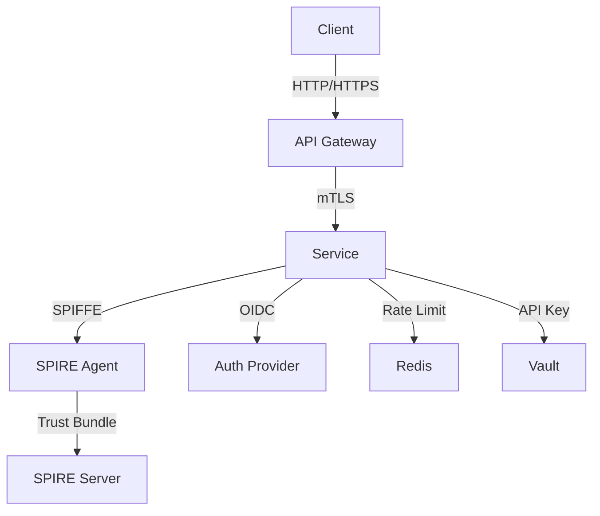
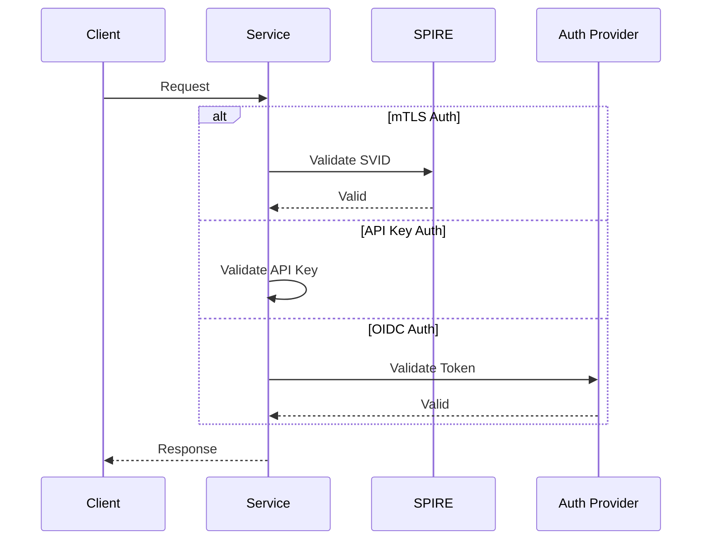
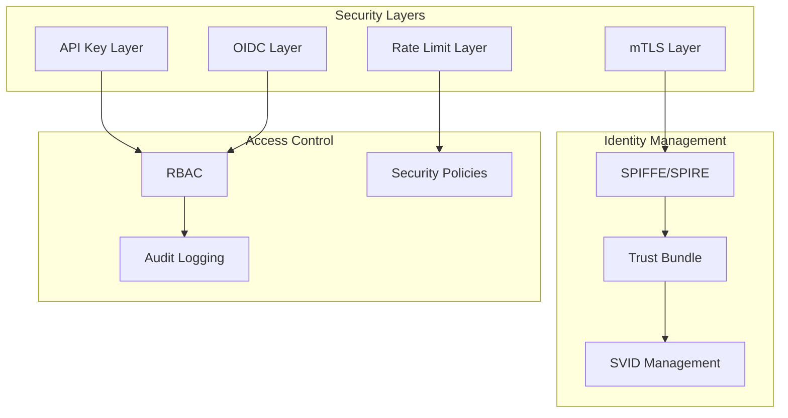

# Authentication Middleware Example with SPIFFE/SPIRE Integration

## Architecture Overview

### Component Architecture


### Authentication Flow


### Security Architecture


This example demonstrates how to use authentication and rate limiting middlewares in a Go HTTP server with SPIFFE/SPIRE integration for workload identity and mTLS.

## Features

- SPIFFE/SPIRE integration for workload identity
- mTLS for service-to-service communication
- API Key authentication for external services
- OIDC authentication for user authentication
- Role-based access control
- Rate limiting
- Health check endpoint
- OIDC callback handling
- Service mesh integration

## Prerequisites

- Go 1.19 or later
- SPIRE server and agent
- An OIDC provider (for user authentication)
- Istio service mesh (optional)

## Configuration

1. SPIFFE/SPIRE Configuration:
   ```go
   spiffeConfig := &spiffe.Config{
       TrustDomain: "example.org",
       SocketPath:  "/run/spiffe/workload/workload_api.sock",
       WorkloadID:  "spiffe://example.org/service",
   }
   ```

2. Update the OIDC configuration in `main.go`:
   ```go
   oidcConfig := &oidc.Config{
       IssuerURL:      "https://your-oidc-provider.com",
       ClientID:       "your-client-id",
       ClientSecret:   "your-client-secret",
       RedirectURL:    "https://your-service.com/auth/callback",
       Scopes:         []string{"openid", "profile", "email"},
   }
   ```

3. Update the API key configuration:
   ```go
   testKey := &apikey.Key{
       ID:        "your-service-id",
       Hash:      "your-key-hash",
       Roles:     []string{"service"},
       ExpiresAt: time.Now().Add(24 * time.Hour),
   }
   ```

4. Adjust rate limiting settings if needed:
   ```go
   rateLimitConfig := &ratelimit.Config{
       RequestsPerSecond: 10,
       Burst:            5,
       WaitOnLimit:      true,
   }
   ```

5. Service mesh configuration (if using Istio):
   ```yaml
   annotations:
     sidecar.istio.io/inject: "true"
     sidecar.istio.io/logLevel: "debug"
   ```

## Running the Example

1. Start SPIRE server and agent:
   ```bash
   kubectl apply -f ../../infrastructure/kubernetes/spire/
   ```

2. Run the service:
   ```bash
   go run main.go
   ```

The server will start on port 8080 with mTLS enabled.

## Testing the Endpoints

1. Health Check (No Auth Required):
   ```bash
   curl http://localhost:8080/health
   ```

2. Service-to-Service API (mTLS Required):
   ```bash
   # Using mTLS with SPIFFE ID
   curl --cert /run/spiffe/certs/svid.crt \
        --key /run/spiffe/certs/svid.key \
        --cacert /run/spiffe/certs/root-ca.crt \
        https://localhost:8443/api/service
   ```

3. External Service API (API Key Required):
   ```bash
   # Using X-API-Key header
   curl -H "X-API-Key: test-key" http://localhost:8080/api/external

   # Using Authorization header
   curl -H "Authorization: Bearer test-key" http://localhost:8080/api/external
   ```

4. User API (OIDC Token Required):
   ```bash
   curl -H "Authorization: Bearer <your-oidc-token>" http://localhost:8080/api/user
   ```

5. Admin API (OIDC Token with Admin Role Required):
   ```bash
   curl -H "Authorization: Bearer <your-oidc-token-with-admin-role>" http://localhost:8080/api/admin
   ```

6. Rate Limited API:
   ```bash
   curl http://localhost:8080/api/protected
   ```

## Security Best Practices

1. SPIFFE/SPIRE:
   - Use unique SPIFFE IDs for each service
   - Implement proper workload attestation
   - Rotate SVIDs regularly
   - Validate trust domains
   - Implement proper node attestation
   - Use secure workload API socket
   - Monitor SVID issuance and rotation
   - Implement proper error handling for SVID failures
   - Use secure storage for trust bundles
   - Implement proper logging for security events

2. mTLS:
   - Enforce mTLS for all service-to-service communication
   - Use strong cipher suites (TLS 1.3 recommended)
   - Implement certificate pinning
   - Monitor certificate expiration
   - Use secure key storage
   - Implement proper certificate validation
   - Monitor TLS handshake failures
   - Use appropriate key sizes (RSA 2048+ or ECC P-256+)
   - Implement proper error handling for TLS failures
   - Use secure cipher suite configuration

3. API Keys:
   - Store keys securely (e.g., HashiCorp Vault)
   - Implement proper key rotation
   - Use strong hashing algorithms (Argon2id recommended)
   - Monitor key usage
   - Implement rate limiting per key
   - Use secure key generation
   - Implement proper key revocation
   - Monitor for key abuse
   - Use secure key storage
   - Implement proper key validation

4. OIDC:
   - Implement proper token validation
   - Use secure session management
   - Implement proper error handling
   - Monitor authentication attempts
   - Use secure token storage
   - Implement proper token revocation
   - Use secure session cookies
   - Implement proper session timeout
   - Monitor for session hijacking
   - Use secure token transport

5. Rate Limiting:
   - Implement proper rate limiting strategies
   - Monitor rate limit violations
   - Implement proper error handling
   - Use appropriate burst limits
   - Implement per-client rate limiting
   - Use secure rate limit storage
   - Monitor for rate limit abuse
   - Implement proper rate limit configuration
   - Use secure rate limit headers
   - Implement proper rate limit logging

6. Container Security:
   - Use non-root user execution
   - Implement proper resource limits
   - Use read-only filesystem
   - Implement proper security context
   - Use secure container images
   - Implement proper container isolation
   - Monitor container resource usage
   - Use secure container networking
   - Implement proper container logging
   - Use secure container runtime

7. Network Security:
   - Implement proper network policies
   - Use secure network configuration
   - Implement proper DNS security
   - Monitor network traffic
   - Use secure network protocols
   - Implement proper network isolation
   - Monitor for network attacks
   - Use secure network logging
   - Implement proper network monitoring
   - Use secure network configuration

8. Logging and Monitoring:
   - Implement structured logging
   - Use secure log storage
   - Implement proper log rotation
   - Monitor for security events
   - Use secure log transport
   - Implement proper log retention
   - Monitor for log tampering
   - Use secure log analysis
   - Implement proper log access control
   - Use secure log configuration

9. Error Handling:
   - Implement proper error messages
   - Use secure error handling
   - Implement proper error logging
   - Monitor for error patterns
   - Use secure error transport
   - Implement proper error recovery
   - Monitor for error abuse
   - Use secure error configuration
   - Implement proper error reporting
   - Use secure error storage

10. Configuration Security:
    - Use secure configuration storage
    - Implement proper configuration validation
    - Use secure configuration transport
    - Monitor for configuration changes
    - Use secure configuration access
    - Implement proper configuration backup
    - Monitor for configuration tampering
    - Use secure configuration logging
    - Implement proper configuration versioning
    - Use secure configuration management

## Notes

- The example uses an in-memory store for API keys. In production, use a persistent store.
- OIDC configuration includes `SkipIssuerCheck` and `SkipExpiryCheck` for testing. Remove these in production.
- The API key hash in the example is not properly hashed. In production, use proper hashing.
- The OIDC callback endpoint is simplified. In production, implement proper session management and security measures.
- SPIFFE/SPIRE integration requires proper configuration of the SPIRE server and agent.
- Service mesh integration requires proper configuration of Istio or your chosen service mesh.

## SPIFFE/SPIRE Troubleshooting Guide

### Common Issues and Solutions

1. **SVID Issuance Failures**
   ```bash
   # Check SPIRE server logs
   kubectl logs -n spire -l app=spire-server
   
   # Verify workload registration
   kubectl exec -n spire deploy/spire-server -- spire-server entry show
   
   # Check node attestation
   kubectl exec -n spire deploy/spire-server -- spire-server agent list
   ```

   Common causes:
   - Incorrect node attestation
   - Missing workload registration
   - Trust domain mismatch
   - Network connectivity issues

2. **Workload API Connection Issues**
   ```bash
   # Check SPIRE agent status
   kubectl exec -n spire -l app=spire-agent -- spire-agent healthcheck
   
   # Verify workload API socket
   kubectl exec -n demo <pod-name> -- ls -l /run/spiffe/workload/workload_api.sock
   
   # Check agent logs
   kubectl logs -n spire -l app=spire-agent
   ```

   Common causes:
   - Socket permission issues
   - Agent not running
   - Network policy blocking communication
   - Volume mount issues

3. **Certificate Rotation Problems**
   ```bash
   # Check certificate expiration
   kubectl exec -n demo <pod-name> -- spiffe-helper status
   
   # Verify rotation configuration
   kubectl get configmap -n demo spiffe-helper-config -o yaml
   
   # Check rotation logs
   kubectl logs -n demo <pod-name> -c spiffe-helper
   ```

   Common causes:
   - Incorrect rotation interval
   - Permission issues
   - Storage problems
   - Network connectivity issues

4. **Trust Bundle Issues**
   ```bash
   # Verify trust bundle
   kubectl exec -n demo <pod-name> -- cat /run/spiffe/certs/root-ca.crt
   
   # Check trust bundle refresh
   kubectl logs -n demo <pod-name> -c spiffe-helper | grep "trust bundle"
   
   # Verify trust domain
   kubectl get configmap -n demo spiffe-helper-config -o yaml | grep trust_domain
   ```

   Common causes:
   - Trust domain mismatch
   - Bundle refresh failures
   - Storage issues
   - Permission problems

### Debugging Commands

1. **SPIRE Server Debugging**
   ```bash
   # Check server status
   kubectl exec -n spire deploy/spire-server -- spire-server healthcheck
   
   # List all entries
   kubectl exec -n spire deploy/spire-server -- spire-server entry show
   
   # Check server metrics
   kubectl port-forward -n spire svc/spire-server 8080:8080
   curl localhost:8080/metrics | grep spire
   ```

2. **SPIRE Agent Debugging**
   ```bash
   # Check agent status
   kubectl exec -n spire -l app=spire-agent -- spire-agent healthcheck
   
   # List attested nodes
   kubectl exec -n spire deploy/spire-server -- spire-server agent list
   
   # Check agent metrics
   kubectl port-forward -n spire -l app=spire-agent 8080:8080
   curl localhost:8080/metrics | grep spire
   ```

3. **Workload Debugging**
   ```bash
   # Check workload identity
   kubectl exec -n demo <pod-name> -- spiffe-helper verify
   
   # View current certificates
   kubectl exec -n demo <pod-name> -- ls -l /run/spiffe/certs/
   
   # Check workload API connection
   kubectl exec -n demo <pod-name> -- spiffe-helper status
   ```

### Log Analysis

1. **SPIRE Server Logs**
   ```bash
   # View server logs
   kubectl logs -n spire -l app=spire-server
   
   # Filter for specific issues
   kubectl logs -n spire -l app=spire-server | grep -i "error"
   kubectl logs -n spire -l app=spire-server | grep -i "warning"
   ```

2. **SPIRE Agent Logs**
   ```bash
   # View agent logs
   kubectl logs -n spire -l app=spire-agent
   
   # Filter for specific issues
   kubectl logs -n spire -l app=spire-agent | grep -i "error"
   kubectl logs -n spire -l app=spire-agent | grep -i "warning"
   ```

3. **Workload Logs**
   ```bash
   # View helper logs
   kubectl logs -n demo <pod-name> -c spiffe-helper
   
   # Filter for specific issues
   kubectl logs -n demo <pod-name> -c spiffe-helper | grep -i "error"
   kubectl logs -n demo <pod-name> -c spiffe-helper | grep -i "warning"
   ```

### Health Checks

1. **SPIRE Server Health**
   ```bash
   # Check server health
   kubectl exec -n spire deploy/spire-server -- spire-server healthcheck
   
   # Verify server metrics
   kubectl port-forward -n spire svc/spire-server 8080:8080
   curl localhost:8080/health
   ```

2. **SPIRE Agent Health**
   ```bash
   # Check agent health
   kubectl exec -n spire -l app=spire-agent -- spire-agent healthcheck
   
   # Verify agent metrics
   kubectl port-forward -n spire -l app=spire-agent 8080:8080
   curl localhost:8080/health
   ```

3. **Workload Health**
   ```bash
   # Check helper health
   kubectl exec -n demo <pod-name> -- spiffe-helper healthcheck
   
   # Verify certificate status
   kubectl exec -n demo <pod-name> -- spiffe-helper status
   ```

### Recovery Procedures

1. **SVID Recovery**
   ```bash
   # Restart SPIRE helper
   kubectl delete pod -n demo <pod-name>
   
   # Verify new SVID
   kubectl exec -n demo <pod-name> -- spiffe-helper verify
   ```

2. **Trust Bundle Recovery**
   ```bash
   # Refresh trust bundle
   kubectl exec -n demo <pod-name> -- spiffe-helper refresh
   
   # Verify trust bundle
   kubectl exec -n demo <pod-name> -- cat /run/spiffe/certs/root-ca.crt
   ```

3. **Workload API Recovery**
   ```bash
   # Restart SPIRE agent
   kubectl delete pod -n spire -l app=spire-agent
   
   # Verify agent status
   kubectl exec -n spire -l app=spire-agent -- spire-agent healthcheck
   ```

### Monitoring and Alerts

1. **Key Metrics to Monitor**
   - SVID issuance success rate
   - Certificate rotation success rate
   - Trust bundle refresh success rate
   - Workload API connection status
   - Node attestation success rate

2. **Recommended Alerts**
   - SVID issuance failures
   - Certificate rotation failures
   - Trust bundle refresh failures
   - Workload API connection issues
   - Node attestation failures

3. **Alert Response Procedures**
   - Check relevant logs
   - Verify configuration
   - Check network connectivity
   - Verify permissions
   - Check resource availability

## Implementation Details

### Middleware Stack
```go
// Middleware chain configuration
middleware := []Middleware{
    NewSPIFFEMiddleware(spiffeConfig),
    NewRateLimitMiddleware(rateLimitConfig),
    NewAuthMiddleware(authConfig),
    NewLoggingMiddleware(logConfig),
    NewMetricsMiddleware(metricsConfig),
}
```

### SPIFFE Integration
```go
// SPIFFE middleware implementation
type SPIFFEMiddleware struct {
    config *spiffe.Config
    client *spiffe.Client
}

func (m *SPIFFEMiddleware) Handle(next http.Handler) http.Handler {
    return http.HandlerFunc(func(w http.ResponseWriter, r *http.Request) {
        // Validate SVID
        svid, err := m.client.GetSVID()
        if err != nil {
            http.Error(w, "Unauthorized", http.StatusUnauthorized)
            return
        }
        
        // Add SPIFFE ID to context
        ctx := context.WithValue(r.Context(), "spiffe_id", svid.ID)
        next.ServeHTTP(w, r.WithContext(ctx))
    })
}
```

### Rate Limiting Implementation
```go
// Rate limiting middleware implementation
type RateLimitMiddleware struct {
    limiter *rate.Limiter
    store   *redis.Client
}

func (m *RateLimitMiddleware) Handle(next http.Handler) http.Handler {
    return http.HandlerFunc(func(w http.ResponseWriter, r *http.Request) {
        // Get client identifier
        clientID := getClientID(r)
        
        // Check rate limit
        if !m.limiter.Allow(clientID) {
            http.Error(w, "Rate limit exceeded", http.StatusTooManyRequests)
            return
        }
        
        next.ServeHTTP(w, r)
    })
}
```

### Authentication Implementation
```go
// Authentication middleware implementation
type AuthMiddleware struct {
    config *auth.Config
    provider *oidc.Provider
}

func (m *AuthMiddleware) Handle(next http.Handler) http.Handler {
    return http.HandlerFunc(func(w http.ResponseWriter, r *http.Request) {
        // Validate authentication
        token, err := m.validateAuth(r)
        if err != nil {
            http.Error(w, "Unauthorized", http.StatusUnauthorized)
            return
        }
        
        // Add claims to context
        ctx := context.WithValue(r.Context(), "claims", token.Claims)
        next.ServeHTTP(w, r.WithContext(ctx))
    })
}
```

## Integration Examples

### Service Mesh Integration
```yaml
# Istio VirtualService configuration
apiVersion: networking.istio.io/v1alpha3
kind: VirtualService
metadata:
  name: service-vs
spec:
  hosts:
  - service
  http:
  - match:
    - uri:
        prefix: /api
    route:
    - destination:
        host: service
        port:
          number: 8443
    retries:
      attempts: 3
      perTryTimeout: 2s
```

### Monitoring Integration
```yaml
# Prometheus metrics configuration
apiVersion: monitoring.coreos.com/v1
kind: ServiceMonitor
metadata:
  name: service-monitor
spec:
  selector:
    matchLabels:
      app: service
  endpoints:
  - port: metrics
    interval: 15s
    path: /metrics
```

### Logging Integration
```yaml
# Fluentd configuration
apiVersion: logging.banzaicloud.io/v1beta1
kind: Flow
metadata:
  name: service-flow
spec:
  filters:
  - parser:
      remove_key_name_field: true
      parse:
        type: json
  match:
  - select:
      labels:
        app: service
  localOutputRefs:
  - service-output
```

## Performance Tuning

### Rate Limiting Configuration
```yaml
rateLimitConfig:
  requestsPerSecond: 100
  burst: 50
  perClient: true
  storage:
    type: redis
    config:
      address: redis:6379
      password: ${REDIS_PASSWORD}
      db: 0
```

### Caching Configuration
```yaml
cacheConfig:
  type: redis
  config:
    address: redis:6379
    password: ${REDIS_PASSWORD}
    db: 1
    ttl: 3600
```

### Metrics Configuration
```yaml
metricsConfig:
  enabled: true
  path: /metrics
  port: 9090
  labels:
    app: service
    environment: production
```

## Security Hardening

### TLS Configuration
```yaml
tlsConfig:
  minVersion: TLS1.3
  cipherSuites:
    - TLS_AES_128_GCM_SHA256
    - TLS_AES_256_GCM_SHA384
  curvePreferences:
    - CurveP521
    - CurveP384
  preferServerCipherSuites: true
```

### API Key Security
```yaml
apiKeyConfig:
  algorithm: argon2id
  params:
    memory: 65536
    iterations: 3
    parallelism: 4
  storage:
    type: vault
    path: secret/api-keys
```

### OIDC Security
```yaml
oidcConfig:
  issuer: https://auth.example.com
  clientID: ${OIDC_CLIENT_ID}
  clientSecret: ${OIDC_CLIENT_SECRET}
  redirectURL: https://service.example.com/callback
  scopes:
    - openid
    - profile
    - email
  maxAge: 3600
``` 